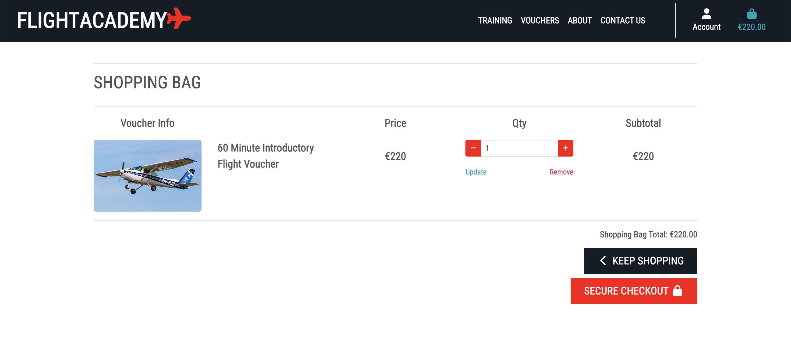
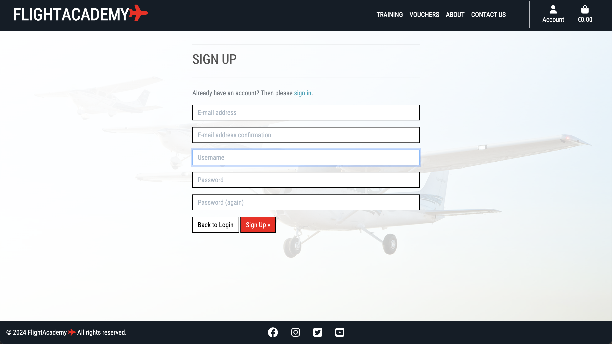

# [FLIGHT ACADEMY](https://flight-academy-e7e5adf022d9.herokuapp.com)

Welcome to Flight Academy! Flight Academy is a website used to advertise and promote the training options and vouchers available for sale from the flight school of the same name. Users are able to browse through the multiple training courses on offer and learn more about each individual course. They also have the option of registering their interest in a particular course in order to receive further information and contact from the flight school. Users can also browse through the list of flight vouchers available and make a purchase directly through the site. People interested in becoming a pilot or aviation enthusiasts in general will find this website useful as they can obtain the information required to begin planning their training, or sign up for a monthly newsletter where they will get the latest industry news. From the site owners perspective, the Flight Academy website is a well laid out, clean and informative. The site admin can create, edit and delete new vouchers and training courses from the front end without having to access the admin panel. The site is aimed at users from early teens upwards and at anyone who has an interest in aviation from both a professional and casual perspective. Users will find the site intuitive and responsive across all devices.


## UX

The design of the site is intended to reflect the business and industry it intends to promote and sell. Strong colours, with minimalist features give the site a bold, striking and professional appearance. Each page features a main background image with a faded overlay and strong bold text for emphasis. Both the training courses and vouchers available are displayed on card backgrounds, with large text and headline images. The sleek and minimalist navbar ensures effortless navigation. The responsive design guarantees a smooth and visually appealing interface, whether you're on a desktop, tablet, or mobile.

### Colour Scheme

- `#ffffff` used for primary text.
- `#fb000e` used for primary highlights.
- `#555555` used for secondary text.
- `#131d27` used for secondary highlights.

I used [coolors.co](https://coolors.co/131d27-fb000e-ffffff-555555-f6f7f9) to generate my colour palette.


<!-- 🛑🛑🛑🛑🛑 START OF NOTES (to be deleted) 🛑🛑🛑🛑🛑

If you've used CSS `:root` variables, consider also including a code snippet here!

🛑🛑🛑🛑🛑 END OF NOTES (to be deleted) 🛑🛑🛑🛑🛑 -->

I've used CSS `:root` variables to easily update the global colour scheme by changing only one value, instead of everywhere in the CSS file.

```css
:root {
    /* P = Primary | S = Secondary */
    --p-text: #000000;
    --p-highlight: #E84610;
    --s-text: #4A4A4F;
    --s-highlight: #009FE3;
    --white: #FFFFFF;
    --black: #000000;
}
```

### Typography

- [Roboto Condensed](https://fonts.google.com/specimen/Roboto+Condensed) was used for all text.

- [Font Awesome](https://fontawesome.com) icons were used throughout the site, such as the social media icons in the footer.

## User Stories

### New Site Users

- As a new site user, I would like to view a list of products, so that I can decide which one to purchase.
- As a new site user, I would like to view individual product details, so that I can decide which one I want to purchase.
- As a new site user, I would like to clearly see the types of products available, so that I can select the appropriate one.
- As a new site user, I would like to easily add a product to my shopping bag, so that I can purchase the product.
- As a new site user, I would like to view the items in my bag to be purchased, so that I can know which products I have selected.
- As a new site user, I would like to adjust the quantity of products in my bag, so that I can increase or decrease the number of products I want to purchase.
- As a new site user, I would like to easily view the total price of my purchases, so that I can stay aware of my spending.
- As a new site user, I would like to easily enter my payment information, so that I can pay for my chosen products with great ease.
- As a new site user, I would like to view an order confirmation after checkout, so that I can have a record of what I have ordered.
- As a new site user, I would like to receive an email confirmation, so that I can have proof of purchase.
- As a new site user, I would like to subscribe to a newsletter, so that I can get more information.
- As a new site user, I would like to view different training courses, so that I can assess my options.

### Returning Site Users

- As a returning site user, I would like to register an account, so that I can have a personal account.
- As a returning site user, I would like to login to my account, so that I can access my personal account.
- As a returning site user, I would like to logout of my account, so that I can logout of my personal account.
- As a returning site user, I would like to recover my password, so that I can regain access to my account.
- As a returning site user, I would like to know my information is secure, so that I can be confident in entering my payment information.
- As a returning site user, I would like to access links to social media pages, so that I can view their social media content.

### Site Admin

- As a site administrator, I should be able to add new products to the store, so that I can increase the amount of products on offer.
- As a site administrator, I should be able to edit or update products, so that I can keep the product information up to date.
- As a site administrator, I should be able to delete products from the store, so that I can remove products that are no longer for sale.
- As a site administrator, I should be able to add new training course options, so that I can improve what the site has to offer.
- As a site administrator, I should be able to edit training courses, so that I can change certain aspects as needs be.
- As a site administrator, I should be able to delete training courses, so that I can remove courses that are no longer available.

## Wireframes

<!-- 🛑🛑🛑🛑🛑 START OF NOTES (to be deleted) 🛑🛑🛑🛑🛑

In this section, display your wireframe screenshots using a Markdown `table`.
Instructions on how to do Markdown `tables` start on line #213 on this site: https://pandao.github.io/editor.md/en.html

Alternatively, dropdowns are a way to condense several wireframes into a collapsible menu to save space.
Dropdowns in Markdown are considered some of the only acceptable HTML components that are allowed for assessment purposes.

**IMPORTANT**! **IMPORTANT**! **IMPORTANT**!
The example below uses the `details` and `summary` code elements.
However, for these scripts to work, I've had to add spaces within the `< >` elements.

You MUST remove these spaces for it to work properly on your own README/TESTING files.
Remove the spaces within the `< >` brackets for the `details` and `summary` code elements,
for the Mobile, Tablet, and Desktop wireframes.

🛑🛑🛑🛑🛑 END OF NOTES (to be deleted) 🛑🛑🛑🛑🛑 -->

To follow best practice, wireframes were developed for mobile, tablet, and desktop sizes.
I've used [Balsamiq](https://balsamiq.com/wireframes) to design my site wireframes.

### Mobile Wireframes

<details>
<summary> Click here to see the Mobile Wireframes </summary>

Home
  - 

Training
  - 

Vouchers
  - 

Contact
  - 

</details>

### Tablet Wireframes

<details>
<summary> Click here to see the Tablet Wireframes </summary>

Home
  - 

Training
  - 

Vouchers
  - 

Contact
  - 

</details>

### Desktop Wireframes

<details>
<summary> Click here to see the Desktop Wireframes </summary>

Home
  - 

Training
  - 

Vouchers
  - 

Contact
  - 

</details>

## Features

### Existing Features

- **Landing Page**

    - Visitors to the site will first encounter the landing page which is the homepage of the site. The homepage consists of a navbar at the top with a hero background image as the main feature of the page. The navbar is a solid dark colour with contrasting white text displaying the site name/logo and a contrasting red Font Awesome icon. On medium sized screens and larger, the right side of the navbar features navigation links to the training, voucher and contact us page. A vertical white divider line separates the navigation links from the account and shopping bag links. The main section of the page features a background image of a line of aircraft with a dark overlay with graduated darkness. There is also a large, bright and contrasting Learn More button which links to the About page.


- **Navbar**

    -  The navbar is sticky whereby it is a constant feature at the top of the screen. As the page is fully responsive the navbar compresses on smaller screen sizes along with the logo. The account and shopping bag links move into a dropdown menu separated by a red horizontal divider line


- **Footer**

    - The footer is the same dark navy in colour and features the copyright statement and the social media links.


- **Training Page**

    - The Training Page consists of a large background image at the top with a dark overlay and strong large white text over it. Beneath this are the training course options, displayed on individual cards. Each individual card features an image at the top, the title of the specific course, the aircraft type. The price of the course is at the bottom of the card in white text on a dark navy background.


- **Training Course Details Page**

    - Users can click on each individual Training Course card which will open a Training Details page. This page consists of an image on the left with the aircraft type listed beneath it between horizontal dividing lines. On the right there is the title of the course, followed by the price of the course. Beneath that there is some information text about the course. There is a large red Learn More button which leads to a contact form to register for more information about the courses.


- **Admin Add/Edit/Delete buttons**

    - As a superuser/admin of the site, there are buttons available to add new training courses/vouchers, edit and delete.


- **Vouchers Page**

    - The Vouchers Page consists of a large background image at the top with a dark overlay and strong large white text over it. Beneath this are the various voucher options, displayed on individual cards. Each individual card features an image at the top, the title of the specific voucher, the aircraft type. The price of the voucher is at the bottom of the card in white text on a dark navy background.


- **Voucher Details Page**

    - Users can click on each individual Voucher card which will open a Voucher Details page. This page consists of an image on the left with the aircraft type listed beneath it between horizontal dividing lines. On the right there is the title of the voucher, followed by the price of the voucher. Beneath that there is some information text about the voucher. There is a quantity selector with red +/- buttons in line with the red colour throughtout the site. Beneath that there are two buttons, a dark navy Keep Shopping button which returns to the Vouchers page, and a Add To Bag button which adds the voucher to the shopping bag.


- **Order Summary**

    - When a user adds a voucher to their shopping bag, an Order Summary box appears. The total cost now appears in the top right corner on the shopping bag icon. The voucher selected is listed in the shopping bag with the total price listed again. At the bottom there is a large Go To Secure Checkout button to progress along the payment flow.


- **Shopping Bag**

    - The Shopping Bag page features the specific voucher details and preview image. Beneath a horizontal dividing line there is the total cost along with a Keep Shopping button and a Secure Checkout button.



- **Checkout Page**

    - The checkout page features input fields for name, email and credit card details. There are buttons to Adjust the Shopping Bag and Complete Order. On the right there is a summary of the order.


- **Checkout Loading**

    - Upon clicking Complete Order, a loading page appears with a spinning red icon on a dark transparent overlay.


- **Order Confirmation Page**

    - Upon successful completion of the transaction, the user is presented with an Order Confirmation page. This page consists of a summary of the order as well as a success message in the top right of the page.


- **About Page**

    - The About Page features three background images and two bodies of information text. Each passage of text features a button linking to either the Vouchers Page or the Training Courses Page.


- **Newsletter**

    - At the bottom of the About Page, there is an input box for users to submit their email addresses to sign up for the monthly newsletter.


- **Contact Us Page**

    - The Contact Us link in the navbar opens the Contact Us page. It consists of a form for users to fill out to gain more information regarding specific training courses.


- **Profile Page**

    - Once a user is logged in, they can access their Profile through the Account dropdown menu in the navbar. The Profile Page consists of the user's order history.


- **Register**

    - Users can register an account by selecting the Register button from the Account dropdown menu in the navbar. The page consists of a registration form with a background image with a strong white overlay.



- **Login**

    - Users can login to their account by selecting the Login button from the Account dropdown menu in the navbar. The page consists of input fields requesting username/email, password with a background image with a strong white overlay.


### Future Features

- Carousel Effect for homepage images
    - Add carousel effect to scroll through multiple images on the homepage to display more aspects of the Flight School.
- Gallery Section
    - Gallery to display images of the Flight School to give the user a better understanding of the quality of the school.
- Job Vacancies Section
    - Section to advertise job vacancies and accept applications.

## Tools & Technologies Used

- [HTML](https://en.wikipedia.org/wiki/HTML) used for the main site content.
- [CSS](https://en.wikipedia.org/wiki/CSS) used for the main site design and layout.
- [CSS Flexbox](https://www.w3schools.com/css/css3_flexbox.asp) used for an enhanced responsive layout.
- [JavaScript](https://www.javascript.com) used for user interaction on the site.
- [Python](https://www.python.org) used as the back-end programming language.
- [Git](https://git-scm.com) used for version control. (`git add`, `git commit`, `git push`)
- [GitHub](https://github.com) used for secure online code storage.
- [Gitpod](https://gitpod.io) used as a cloud-based IDE for development.
- [Bootstrap](https://getbootstrap.com) used as the front-end CSS framework for modern responsiveness and pre-built components.
- [Django](https://www.djangoproject.com) used as the Python framework for the site.
- [ElephantSQL](https://www.elephantsql.com) used as the Postgres database.
- [Heroku](https://www.heroku.com) used for hosting the deployed back-end site.
- [Cloudinary](https://cloudinary.com) used for online static file storage.
- [Stripe](https://stripe.com) used for online secure payments of ecommerce products/services.

## Database Design

Entity Relationship Diagrams (ERD) help to visualize database architecture before creating models.
Understanding the relationships between different tables can save time later in the project.

```python
class Voucher(models.Model):
    """
    A model to handle the various flight vouchers.
    """
    title = models.CharField(max_length=100, null=False, blank=False)
    description = models.TextField(null=False, blank=False)
    duration = models.PositiveIntegerField(
        default=30,
        validators=[MinValueValidator(30)],
        null=False, blank=False)
    cost = models.PositiveIntegerField(null=False, blank=False)
    aircraft_type = models.ForeignKey(
        Aircraft, on_delete=models.CASCADE, null=False, blank=False)
    image = CloudinaryField(
        "image", default="placeholder", null=False, blank=False)

    class Meta:
        ordering = ["aircraft_type"]

    def __str__(self):
        return self.title
```

```python
class Aircraft(models.Model):
    """
    A model to handle aircraft types.
    """
    SEATS = [("2", "2"), ("4", "4"),]
    ENGINES = [("1", "1"), ("2", "2"),]

    aircraft_type = models.CharField(max_length=100, null=False, blank=False)
    seats = models.CharField(
        choices=SEATS, default="2",
        max_length=1, null=False, blank=False)
    engines = models.CharField(
        choices=ENGINES, default="1",
        max_length=1, null=False, blank=False)

    class Meta:
        ordering = ["aircraft_type"]
        verbose_name_plural = 'Aircraft'

    def __str__(self):
        return self.aircraft_type
```

```python
class Contact(models.Model):
    """ A model to handle a contact form """

    first_name = models.CharField(max_length=75, blank=False, null=False)
    last_name = models.CharField(max_length=75, blank=False, null=False)
    email = models.EmailField(max_length=256, blank=False, null=False)
    phone_num = models.CharField(max_length=30, null=True)
    specific_course = models.ForeignKey(
        Training, on_delete=models.CASCADE, null=False, blank=False)
    message = models.TextField(blank=False, null=False)
    msg_date = models.DateTimeField(auto_now_add=True, blank=False, null=False)

    def __str__(self):
        return self.email
```

```python
class Newsletter(models.Model):
    """
    A model to handle the newsletter signups.
    """
    email = models.EmailField(max_length=256, null=False, blank=False)

    def __str__(self):
        return self.email
```

```python
class Order(models.Model):
    order_number = models.CharField(max_length=32, null=False, editable=False)
    user_profile = models.ForeignKey(UserProfile, on_delete=models.SET_NULL,
                                    null=True, blank=True, related_name='orders')
    full_name = models.CharField(max_length=50, null=False, blank=False)
    email = models.EmailField(max_length=254, null=False, blank=False)
    phone_number = models.CharField(max_length=20, null=False, blank=False)
    country = models.CharField(max_length=40, null=False, blank=False)
    postcode = models.CharField(max_length=20, null=True, blank=True)
    town_or_city = models.CharField(max_length=40, null=False, blank=False)
    street_address1 = models.CharField(max_length=80, null=False, blank=False)
    street_address2 = models.CharField(max_length=80, null=True, blank=True)
    county = models.CharField(max_length=80, null=True, blank=True)
    date = models.DateTimeField(auto_now_add=True)
    order_total = models.DecimalField(max_digits=10, decimal_places=2, null=False, default=0)
    grand_total = models.DecimalField(max_digits=10, decimal_places=2, null=False, default=0)
    original_shopping_bag = models.TextField(null=False, blank=False, default='')
    stripe_pid = models.CharField(max_length=254, null=False, blank=False, default='')

    def _generate_order_number(self):
        """
        Generate a random, unique order number using UUID
        """
        return uuid.uuid4().hex.upper()

    def update_total(self):
        """
        Update grand total each time a line item is added
        """
        self.order_total = self.lineitems.aggregate(Sum('lineitem_total'))['lineitem_total__sum'] or 0
        self.grand_total = self.order_total
        self.save()

    def save(self, *args, **kwargs):
        """
        Override the original save method to set the order number
        if it hasn't been set already
        """
        if not self.order_number:
            self.order_number = self._generate_order_number()
        super().save(*args, **kwargs)

    def __str__(self):
        return self.order_number
```

```python
class OrderLineItem(models.Model):
    order = models.ForeignKey(Order, null=False, blank=False, on_delete=models.CASCADE, related_name='lineitems')
    voucher = models.ForeignKey(Voucher, null=False, blank=False, on_delete=models.CASCADE)
    quantity = models.IntegerField(null=False, blank=False, default=0)
    lineitem_total = models.DecimalField(max_digits=6, decimal_places=2, null=False, blank=False, editable=False)

    def save(self, *args, **kwargs):
        """
        Override the original save method to set the lineitem total
        and update the order total
        """
        self.lineitem_total = self.voucher.cost * self.quantity
        super().save(*args, **kwargs)

    def __str__(self):
        return self.order.order_number
```

```python
class Licence(models.Model):
    """
    A model to handle licence types
    """
    ENGINES = [("1", "1"), ("2", "2"),]

    licence_type = models.CharField(max_length=100, null=False, blank=False)
    required_flight_time = models.PositiveIntegerField(
        default=30,
        validators=[MinValueValidator(30), MaxValueValidator(1500)],
        null=False, blank=False
    )
    engines = models.CharField(
        choices=ENGINES, default="1",
        max_length=1, null=False, blank=False)

    class Meta:
        ordering = ["required_flight_time"]

    def __str__(self):
        return self.licence_type
```

```python
class Training(models.Model):
    """
    A model to handle the training course options
    """
    MODES = [
        ("Modular", "Modular"),
        ("Integrated", "Integrated"),
    ]

    title = models.CharField(max_length=100, null=False, blank=False)
    description = models.TextField(null=False, blank=False)
    licence_type = models.ForeignKey(
        Licence, on_delete=models.CASCADE, null=False, blank=False)
    cost = models.PositiveIntegerField(null=False, blank=False)
    mode_of_training = models.CharField(
        choices=MODES, default="Modular", max_length=50,
        null=False, blank=False
    )
    aircraft_type = models.ForeignKey(
        Aircraft, on_delete=models.CASCADE, null=False, blank=False)
    image = CloudinaryField(
        "image", default="placeholder", null=False, blank=False)

    class Meta:
        ordering = ["cost"]
        verbose_name_plural = 'Training'

    def __str__(self):
        return self.title
```

```python
class UserProfile(models.Model):
    """
    A user profile model for maintaining a user profile and order history
    """
    user = models.OneToOneField(User, on_delete=models.CASCADE)
    full_name = models.CharField(max_length=50, null=False, blank=False)
    email = models.EmailField(max_length=254, null=False, blank=False)

    def __str__(self):
        return self.user.username


@receiver(post_save, sender=User)
def create_or_update_user_profile(sender, instance, created, **kwargs):
    """
    Create or update the user profile
    """
    if created:
        UserProfile.objects.create(user=instance)
    # Existing users: just save the profile
    instance.userprofile.save()
```


- Table: **Voucher**

    | **PK** | **id** (unique) | Type | Notes |
    | --- | --- | --- | --- |
    | | title | CharField | |
    | | description | TextField | |
    | | duration | PositiveIntegerField | |
    | | cost | PositiveIntegerField | |
    | | aircraft_type | ForeignKey | FK to **Aircraft** model |
    | | image | CloudinaryField | |

- Table: **Aircraft**

    | **PK** | **id** (unique) | Type | Notes |
    | --- | --- | --- | --- |
    | | aircraft_type | CharField | FK to **Voucher** model |
    | | seats | CharField | |
    | | engines | TextField | |

- Table: **Contact**

    | **PK** | **id** (unique) | Type | Notes |
    | --- | --- | --- | --- |
    | | first_name | CharField | |
    | | last_name | CharField | |
    | | email | EmailField | |
    | | phone_num | CharField | |
    | | specific_course | ForeignKey | FK to **Training** model |
    | | message | TextField | |
    | | msg_date | TextField | |

- Table: **Newsletter**

    | **PK** | **id** (unique) | Type | Notes |
    | --- | --- | --- | --- |
    | | email | EmailField | |

- Table: **Order**

    | **PK** | **id** (unique) | Type | Notes |
    | --- | --- | --- | --- |
    | | order_number | CharField | |
    | | user_profile | ForeignKey | FK to **UserProfile** model |
    | | full_name | CharField | |
    | | email | EmailField | |
    | | date | DateTimeField | |
    | | grand_total | DecimalField | |
    | | original_shopping_bag | TextField | |
    | | stripe_pid | CharField | |

- Table: **OrderLineItem**

    | **PK** | **id** (unique) | Type | Notes |
    | --- | --- | --- | --- |
    | | order | ForeignKey | FK to **Order** model |
    | | voucher | ForeignKey | FK to **Voucher** model |
    | | quantity | IntegerField | |
    | | lineitem_total | DecimalField | |

- Table: **Licence**

    | **PK** | **id** (unique) | Type | Notes |
    | --- | --- | --- | --- |
    | | licence_type | CharField | |
    | | required_flight_time | PositiveIntegerField | |
    | | engines | CharField | |

- Table: **Training**

    | **PK** | **id** (unique) | Type | Notes |
    | --- | --- | --- | --- |
    | | title | CharField | |
    | | description | TextField | |
    | | licence_type | ForeignKey | FK to **Licence** model |
    | | cost | PositiveIntegerField | |
    | | mode_of_training | CharField | |
    | | aircraft_type | ForeignKey | FK to **Aircraft** model |
    | | image | CloudinaryField | |

- Table: **UserProfile**

    | **PK** | **id** (unique) | Type | Notes |
    | --- | --- | --- | --- |
    | | user | OneToOneField | |
    | | full_name | CharField | |
    | | email | EmailField | |

## Agile Development Process

### GitHub Projects

[GitHub Projects](https://github.com/JamesH003/flight_academy/projects) served as an Agile tool for this project.
It isn't a specialized tool, but with the right tags and project creation/issue assignments, it can be made to work.

Through it, user stories, issues and tasks were planned, then tracked on a weekly basis using the basic Kanban board.


### GitHub Issues

[GitHub Issues](https://github.com/JamesH003/flight_academy/issues) served as an another Agile tool.
There, I used my own **User Story Template** to manage user stories.

It also helped with milestone iterations on a weekly basis.

- [Open Issues](https://github.com/JamesH003/flight_academy/issues)

    

- [Closed Issues](https://github.com/JamesH003/flight_academy/issues?q=is%3Aissue+is%3Aclosed)

    

### MoSCoW Prioritization

I've decomposed my Epics into stories prior to prioritizing and implementing them.
Using this approach, I was able to apply the MoSCow prioritization and labels to my user stories within the Issues tab.

- **Must Have**: guaranteed to be delivered (*max 60% of stories*)
- **Should Have**: adds significant value, but not vital (*the rest ~20% of stories*)
- **Could Have**: has small impact if left out (*20% of stories*)
- **Won't Have**: not a priority for this iteration

## Ecommerce Business Model

This site sells goods to individual customers, and therefore follows a `Business to Customer` model.
It is of the simplest **B2C** forms, as it focuses on individual transactions, and doesn't need anything
such as monthly/annual subscriptions.

It is still in its early development stages, although it already has a newsletter, and links for social media marketing.

Social media can potentially build a community of users around the business, and boost site visitor numbers,
especially when using larger platforms such a Facebook.

A newsletter list can be used by the business to send regular messages to site users.
For example, what items are on special offer, new items in stock,
updates to business hours, notifications of events, and much more!

## Search Engine Optimization (SEO) & Social Media Marketing

### Keywords

I've identified some appropriate keywords to align with my site, that should help users
when searching online to find my page easily from a search engine.
This included a series of the following keyword types

- Short-tail (head terms) keywords
- Long-tail keywords

I also played around with [Word Tracker](https://www.wordtracker.com) a bit
to check the frequency of some of my site's primary keywords (only until the free trial expired).

### Sitemap

I've used [XML-Sitemaps](https://www.xml-sitemaps.com) to generate a sitemap.xml file.
This was generated using my deployed site URL: https://flight-academy-e7e5adf022d9.herokuapp.com

After it finished crawling the entire site, it created a
[sitemap.xml](sitemap.xml) which I've downloaded and included in the repository.

### Robots

I've created the [robots.txt](robots.txt) file at the root-level.
Inside, I've included the default settings:

```
User-agent: *
Disallow:
Sitemap: https://flight-academy-e7e5adf022d9.herokuapp.com/sitemap.xml
```

Further links for future implementation:
- [Google search console](https://search.google.com/search-console)
- [Creating and submitting a sitemap](https://developers.google.com/search/docs/advanced/sitemaps/build-sitemap)
- [Managing your sitemaps and using sitemaps reports](https://support.google.com/webmasters/answer/7451001)
- [Testing the robots.txt file](https://support.google.com/webmasters/answer/6062598)

### Social Media Marketing

Creating a strong social base (with participation) and linking that to the business site can help drive sales.
Using more popular providers with a wider user base, such as Facebook, typically maximizes site views.

I've created a mockup Facebook business account using the
[Balsamiq template](https://code-institute-org.github.io/5P-Assessments-Handbook/files/Facebook_Mockups.zip)
provided by Code Institute.


### Newsletter Marketing

I have incorporate a newsletter sign-up form on my application, to allow users to supply their
email address if they are interested in learning more. 

<!-- 🛑🛑🛑🛑🛑 START OF NOTES (to be deleted) 🛑🛑🛑🛑🛑

Option 1 (MailChimp):
- Sign up for a Mailchimp account
- This allows up to 2,500 subscription email sends per month
- Incorporate the code and scripts into your project like in the CI lessons.

Option 2 (Django):
- Create a custom newsletter app in your project, with a custom model.
- This method satisfies two assessment criteria:
    - include a newsletter
    - one of your custom models
- It doesn't need anything except the "email" on the model.
- Example:
    ```python
    class Newsletter(models.Model):
    email = models.EmailField(null=False, blank=False)

    def __str__(self):
        return self.email
    ```
- Consider using the same `send_mail()` functionality used on the `webhook_handler.py` file.
    - You can trigger an email sent out to subscribed users when new products are added to the site!

🛑🛑🛑🛑🛑 END OF NOTES (to be deleted) 🛑🛑🛑🛑🛑 -->

## Testing

For all testing, please refer to the [TESTING.md](TESTING.md) file.

## Deployment

<!-- 🛑🛑🛑🛑🛑 START OF NOTES (to be deleted) 🛑🛑🛑🛑🛑

**IMPORTANT:**

- ⚠️ DO NOT update the environment variables to your own! These should NOT be included in this file; just demo values! ⚠️
- ⚠️ DO NOT update the environment variables to your own! These should NOT be included in this file; just demo values! ⚠️
- ⚠️ DO NOT update the environment variables to your own! These should NOT be included in this file; just demo values! ⚠️

🛑🛑🛑🛑🛑 END OF NOTES (to be deleted) 🛑🛑🛑🛑🛑 -->

The live deployed application can be found deployed on [Heroku](https://flight-academy-e7e5adf022d9.herokuapp.com).

### ElephantSQL Database

This project uses [ElephantSQL](https://www.elephantsql.com) for the PostgreSQL Database.

To obtain your own Postgres Database, sign-up with your GitHub account, then follow these steps:

- Click **Create New Instance** to start a new database.
- Provide a name (this is commonly the name of the project: flight_academy).
- Select the **Tiny Turtle (Free)** plan.
- You can leave the **Tags** blank.
- Select the **Region** and **Data Center** closest to you.
- Once created, click on the new database name, where you can view the database URL and Password.

### Amazon AWS

This project uses [AWS](https://aws.amazon.com) to store media and static files online, due to the fact that Heroku doesn't persist this type of data.

Once you've created an AWS account and logged-in, follow these series of steps to get your project connected.
Make sure you're on the **AWS Management Console** page.

#### S3 Bucket

- Search for **S3**.
- Create a new bucket, give it a name (matching your Heroku app name), and choose the region closest to you.
- Uncheck **Block all public access**, and acknowledge that the bucket will be public (required for it to work on Heroku).
- From **Object Ownership**, make sure to have **ACLs enabled**, and **Bucket owner preferred** selected.
- From the **Properties** tab, turn on static website hosting, and type `index.html` and `error.html` in their respective fields, then click **Save**.
- From the **Permissions** tab, paste in the following CORS configuration:

	```shell
	[
		{
			"AllowedHeaders": [
				"Authorization"
			],
			"AllowedMethods": [
				"GET"
			],
			"AllowedOrigins": [
				"*"
			],
			"ExposeHeaders": []
		}
	]
	```

- Copy your **ARN** string.
- From the **Bucket Policy** tab, select the **Policy Generator** link, and use the following steps:
	- Policy Type: **S3 Bucket Policy**
	- Effect: **Allow**
	- Principal: `*`
	- Actions: **GetObject**
	- Amazon Resource Name (ARN): **paste-your-ARN-here**
	- Click **Add Statement**
	- Click **Generate Policy**
	- Copy the entire Policy, and paste it into the **Bucket Policy Editor**

		```shell
		{
			"Id": "Policy1234567890",
			"Version": "2012-10-17",
			"Statement": [
				{
					"Sid": "Stmt1234567890",
					"Action": [
						"s3:GetObject"
					],
					"Effect": "Allow",
					"Resource": "arn:aws:s3:::your-bucket-name/*"
					"Principal": "*",
				}
			]
		}
		```

	- Before you click "Save", add `/*` to the end of the Resource key in the Bucket Policy Editor (like above).
	- Click **Save**.
- From the **Access Control List (ACL)** section, click "Edit" and enable **List** for **Everyone (public access)**, and accept the warning box.
	- If the edit button is disabled, you need to change the **Object Ownership** section above to **ACLs enabled** (mentioned above).

#### IAM

Back on the AWS Services Menu, search for and open **IAM** (Identity and Access Management).
Once on the IAM page, follow these steps:

- From **User Groups**, click **Create New Group**.
	- Suggested Name: `group-flight_academy` (group + the project name)
- Tags are optional, but you must click it to get to the **review policy** page.
- From **User Groups**, select your newly created group, and go to the **Permissions** tab.
- Open the **Add Permissions** dropdown, and click **Attach Policies**.
- Select the policy, then click **Add Permissions** at the bottom when finished.
- From the **JSON** tab, select the **Import Managed Policy** link.
	- Search for **S3**, select the `AmazonS3FullAccess` policy, and then **Import**.
	- You'll need your ARN from the S3 Bucket copied again, which is pasted into "Resources" key on the Policy.

		```shell
		{
			"Version": "2012-10-17",
			"Statement": [
				{
					"Effect": "Allow",
					"Action": "s3:*",
					"Resource": [
						"arn:aws:s3:::your-bucket-name",
						"arn:aws:s3:::your-bucket-name/*"
					]
				}
			]
		}
		```
	
	- Click **Review Policy**.
	- Suggested Name: `policy-flight_academy` (policy + the project name)
	- Provide a description:
		- "Access to S3 Bucket for flight_academy static files."
	- Click **Create Policy**.
- From **User Groups**, click your "group-flight_academy".
- Click **Attach Policy**.
- Search for the policy you've just created ("policy-flight_academy") and select it, then **Attach Policy**.
- From **User Groups**, click **Add User**.
	- Suggested Name: `user-flight_academy` (user + the project name)
- For "Select AWS Access Type", select **Programmatic Access**.
- Select the group to add your new user to: `group-flight_academy`
- Tags are optional, but you must click it to get to the **review user** page.
- Click **Create User** once done.
- You should see a button to **Download .csv**, so click it to save a copy on your system.
	- **IMPORTANT**: once you pass this page, you cannot come back to download it again, so do it immediately!
	- This contains the user's **Access key ID** and **Secret access key**.
	- `AWS_ACCESS_KEY_ID` = **Access key ID**
	- `AWS_SECRET_ACCESS_KEY` = **Secret access key**

#### Final AWS Setup

- If Heroku Config Vars has `DISABLE_COLLECTSTATIC` still, this can be removed now, so that AWS will handle the static files.
- Back within **S3**, create a new folder called: `media`.
- Select any existing media images for your project to prepare them for being uploaded into the new folder.
- Under **Manage Public Permissions**, select **Grant public read access to this object(s)**.
- No further settings are required, so click **Upload**.

### Stripe API

This project uses [Stripe](https://stripe.com) to handle the ecommerce payments.

Once you've created a Stripe account and logged-in, follow these series of steps to get your project connected.

- From your Stripe dashboard, click to expand the "Get your test API keys".
- You'll have two keys here:
	- `STRIPE_PUBLIC_KEY` = Publishable Key (starts with **pk**)
	- `STRIPE_SECRET_KEY` = Secret Key (starts with **sk**)

As a backup, in case users prematurely close the purchase-order page during payment, we can include Stripe Webhooks.

- From your Stripe dashboard, click **Developers**, and select **Webhooks**.
- From there, click **Add Endpoint**.
	- `https://flight-academy-e7e5adf022d9.herokuapp.com/checkout/wh/`
- Click **receive all events**.
- Click **Add Endpoint** to complete the process.
- You'll have a new key here:
	- `STRIPE_WH_SECRET` = Signing Secret (Wehbook) Key (starts with **wh**)

### Gmail API

This project uses [Gmail](https://mail.google.com) to handle sending emails to users for account verification and purchase order confirmations.

Once you've created a Gmail (Google) account and logged-in, follow these series of steps to get your project connected.

- Click on the **Account Settings** (cog icon) in the top-right corner of Gmail.
- Click on the **Accounts and Import** tab.
- Within the section called "Change account settings", click on the link for **Other Google Account settings**.
- From this new page, select **Security** on the left.
- Select **2-Step Verification** to turn it on. (verify your password and account)
- Once verified, select **Turn On** for 2FA.
- Navigate back to the **Security** page, and you'll see a new option called **App passwords**.
- This might prompt you once again to confirm your password and account.
- Select **Mail** for the app type.
- Select **Other (Custom name)** for the device type.
	- Any custom name, such as "Django" or flight_academy
- You'll be provided with a 16-character password (API key).
	- Save this somewhere locally, as you cannot access this key again later!
	- `EMAIL_HOST_PASS` = user's 16-character API key
	- `EMAIL_HOST_USER` = user's own personal Gmail email address

### Heroku Deployment

This project uses [Heroku](https://www.heroku.com), a platform as a service (PaaS) that enables developers to build, run, and operate applications entirely in the cloud.

Deployment steps are as follows, after account setup:

- Select **New** in the top-right corner of your Heroku Dashboard, and select **Create new app** from the dropdown menu.
- Your app name must be unique, and then choose a region closest to you (EU or USA), and finally, select **Create App**.
- From the new app **Settings**, click **Reveal Config Vars**, and set your environment variables.

| Key | Value |
| --- | --- |
| `AWS_ACCESS_KEY_ID` | user's own value |
| `AWS_SECRET_ACCESS_KEY` | user's own value |
| `DATABASE_URL` | user's own value |
| `DISABLE_COLLECTSTATIC` | 1 (*this is temporary, and can be removed for the final deployment*) |
| `EMAIL_HOST_PASS` | user's own value |
| `EMAIL_HOST_USER` | user's own value |
| `SECRET_KEY` | user's own value |
| `STRIPE_PUBLIC_KEY` | user's own value |
| `STRIPE_SECRET_KEY` | user's own value |
| `STRIPE_WH_SECRET` | user's own value |
| `USE_AWS` | True |

Heroku needs two additional files in order to deploy properly.

- requirements.txt
- Procfile

You can install this project's **requirements** (where applicable) using:

- `pip3 install -r requirements.txt`

If you have your own packages that have been installed, then the requirements file needs updated using:

- `pip3 freeze --local > requirements.txt`

The **Procfile** can be created with the following command:

- `echo web: gunicorn app_name.wsgi > Procfile`
- *replace **app_name** with the name of your primary Django app name; the folder where settings.py is located*

For Heroku deployment, follow these steps to connect your own GitHub repository to the newly created app:

Either:

- Select **Automatic Deployment** from the Heroku app.

Or:

- In the Terminal/CLI, connect to Heroku using this command: `heroku login -i`
- Set the remote for Heroku: `heroku git:remote -a app_name` (replace *app_name* with your app name)
- After performing the standard Git `add`, `commit`, and `push` to GitHub, you can now type:
	- `git push heroku main`

The project should now be connected and deployed to Heroku!

### Local Deployment

This project can be cloned or forked in order to make a local copy on your own system.

For either method, you will need to install any applicable packages found within the *requirements.txt* file.

- `pip3 install -r requirements.txt`.

You will need to create a new file called `env.py` at the root-level,
and include the same environment variables listed above from the Heroku deployment steps.

Sample `env.py` file:

```python
import os

os.environ.setdefault("AWS_ACCESS_KEY_ID", "user's own value")
os.environ.setdefault("AWS_SECRET_ACCESS_KEY", "user's own value")
os.environ.setdefault("DATABASE_URL", "user's own value")
os.environ.setdefault("EMAIL_HOST_PASS", "user's own value")
os.environ.setdefault("EMAIL_HOST_USER", "user's own value")
os.environ.setdefault("SECRET_KEY", "user's own value")
os.environ.setdefault("STRIPE_PUBLIC_KEY", "user's own value")
os.environ.setdefault("STRIPE_SECRET_KEY", "user's own value")
os.environ.setdefault("STRIPE_WH_SECRET", "user's own value")

# local environment only (do not include these in production/deployment!)
os.environ.setdefault("DEBUG", "True")
```

Once the project is cloned or forked, in order to run it locally, you'll need to follow these steps:

- Start the Django app: `python3 manage.py runserver`
- Stop the app once it's loaded: `CTRL+C` or `⌘+C` (Mac)
- Make any necessary migrations: `python3 manage.py makemigrations`
- Migrate the data to the database: `python3 manage.py migrate`
- Create a superuser: `python3 manage.py createsuperuser`
- Load fixtures (if applicable): `python3 manage.py loaddata file-name.json` (repeat for each file)
- Everything should be ready now, so run the Django app again: `python3 manage.py runserver`

If you'd like to backup your database models, use the following command for each model you'd like to create a fixture for:

- `python3 manage.py dumpdata your-model > your-model.json`
- *repeat this action for each model you wish to backup*

#### Cloning

You can clone the repository by following these steps:

1. Go to the [GitHub repository](https://github.com/JamesH003/flight_academy) 
2. Locate the Code button above the list of files and click it 
3. Select if you prefer to clone using HTTPS, SSH, or GitHub CLI and click the copy button to copy the URL to your clipboard
4. Open Git Bash or Terminal
5. Change the current working directory to the one where you want the cloned directory
6. In your IDE Terminal, type the following command to clone my repository:
	- `git clone https://github.com/JamesH003/flight_academy.git`
7. Press Enter to create your local clone.

Alternatively, if using Gitpod, you can click below to create your own workspace using this repository.

[](https://gitpod.io/#https://github.com/JamesH003/flight_academy)

Please note that in order to directly open the project in Gitpod, you need to have the browser extension installed.
A tutorial on how to do that can be found [here](https://www.gitpod.io/docs/configure/user-settings/browser-extension).

#### Forking

By forking the GitHub Repository, we make a copy of the original repository on our GitHub account to view and/or make changes without affecting the original owner's repository.
You can fork this repository by using the following steps:

1. Log in to GitHub and locate the [GitHub Repository](https://github.com/JamesH003/flight_academy)
2. At the top of the Repository (not top of page) just above the "Settings" Button on the menu, locate the "Fork" Button.
3. Once clicked, you should now have a copy of the original repository in your own GitHub account!

### Local VS Deployment

I have not noticed any differences between the local version and the live deployment of the site on Heroku.

## Credits

<!-- 🛑🛑🛑🛑🛑 START OF NOTES (to be deleted) 🛑🛑🛑🛑🛑

In this section you need to reference where you got your content, media, and extra help from.
It is common practice to use code from other repositories and tutorials,
however, it is important to be very specific about these sources to avoid plagiarism.

🛑🛑🛑🛑🛑 END OF NOTES (to be deleted) 🛑🛑🛑🛑🛑 -->

### Content

<!-- 🛑🛑🛑🛑🛑 START OF NOTES (to be deleted) 🛑🛑🛑🛑🛑

Use this space to provide attribution links to any borrowed code snippets, elements, or resources.
A few examples have been provided below to give you some ideas.

Ideally, you should provide an actual link to every resource used, not just a generic link to the main site!

🛑🛑🛑🛑🛑 END OF NOTES (to be deleted) 🛑🛑🛑🛑🛑 -->

| Source | Location | Notes |
| --- | --- | --- |
| [Markdown Builder](https://tim.2bn.dev/markdown-builder) | README and TESTING | tool to help generate the Markdown files |
| [Chris Beams](https://chris.beams.io/posts/git-commit) | version control | "How to Write a Git Commit Message" |
| [W3Schools](https://www.w3schools.com/howto/howto_js_topnav_responsive.asp) | entire site | responsive HTML/CSS/JS navbar |
| [Flexbox Froggy](https://flexboxfroggy.com/) | entire site | modern responsive layouts |
| [Bootstrap](https://getbootstrap.com/docs/4.0/utilities/flex/) | entire site | modern responsive layouts |
| [Bootstrap](https://getbootstrap.com/docs/4.0/components/modal/) | voucher_details & training_details pages | interactive pop-up (modal) |
| [Bootstrap](https://getbootstrap.com/docs/4.0/components/card/) | vouchers & training pages | cards |
| [W3Schools](https://www.w3schools.com/css/css3_gradients.asp) | home page | background image overlay |
| [W3Schools](https://www.w3schools.com/cssref/css3_pr_background-size.php) | background image | background size |
| [W3Schools](https://www.w3schools.com/cssref/pr_scroll-behavior.php) | entire site | smooth scroll |
| [WhiteNoise](http://whitenoise.evans.io) | entire site | hosting static files on Heroku temporarily |

### Media

| Source | Location | Type | Notes |
| --- | --- | --- | --- |
| [Pexels](https://www.pexels.com) | entire site | image | favicon on all pages |
| [Lorem Picsum](https://picsum.photos) | home page | image | hero image background |
| [Unsplash](https://unsplash.com) | product page | image | sample of fake products |
| [Pixabay](https://pixabay.com) | gallery page | image | group of photos for gallery |
| [Wallhere](https://wallhere.com) | footer | image | background wallpaper image in the footer |
| [This Person Does Not Exist](https://thispersondoesnotexist.com) | testimonials | image | headshots of fake testimonial images |
| [Audio Micro](https://www.audiomicro.com/free-sound-effects) | game page | audio | free audio files to generate the game sounds |
| [Videvo](https://www.videvo.net/) | home page | video | background video on the hero section |
| [TinyPNG](https://tinypng.com) | entire site | image | tool for image compression |

### Acknowledgements

<!-- 🛑🛑🛑🛑🛑 START OF NOTES (to be deleted) 🛑🛑🛑🛑🛑

Use this space to provide attribution to any supports that helped, encouraged, or supported you throughout the development stages of this project.
A few examples have been provided below to give you some ideas.

🛑🛑🛑🛑🛑 END OF NOTES (to be deleted) 🛑🛑🛑🛑🛑 -->

- I would like to thank my Code Institute mentor, [Tim Nelson](https://github.com/TravelTimN) for their support throughout the development of this project.
- I would like to thank the [Code Institute](https://codeinstitute.net) tutor team for their assistance with troubleshooting and debugging some project issues.
- I would like to thank the [Code Institute Slack community](https://code-institute-room.slack.com) for the moral support; it kept me going during periods of self doubt and imposter syndrome.
- I would like to thank my partner (John/Jane), for believing in me, and allowing me to make this transition into software development.
- I would like to thank my employer, for supporting me in my career development change towards becoming a software developer.
