# Testing

Return back to the [README.md](README.md) file.

## Code Validation

### HTML

I have used the recommended [HTML W3C Validator](https://validator.w3.org) to validate all of my HTML files.

<!-- 🛑🛑🛑🛑🛑 START OF NOTES (to be deleted) 🛑🛑🛑🛑🛑

- If you are copying/pasting your HTML code, use this link: https://validator.w3.org/#validate_by_input
- (*recommended*) If you are using the live deployed site pages, use this link: https://validator.w3.org/#validate_by_uri

It's recommended to validate the live pages (each of them) using the deployed URL.
This will give you a custom URL as well, which you can use on your testing documentation.
It makes it easier to return back to a page to validate it again in the future.
The URL will look something like this:

- https://validator.w3.org/nu/?doc=https%3A%2F%2FJamesH003.github.io%2Fflight_academy%2Findex.html

Sample HTML code validation documentation (tables are extremely helpful!):

🛑🛑🛑🛑🛑 END OF NOTES (to be deleted) 🛑🛑🛑🛑🛑 -->

| Page | W3C URL | Screenshot | Notes |
| --- | --- | --- | --- |
| Home | [W3C](https://validator.w3.org/nu/?showsource=yes&doc=https%3A%2F%2Fflight-academy-e7e5adf022d9.herokuapp.com%2F#l223c63) | 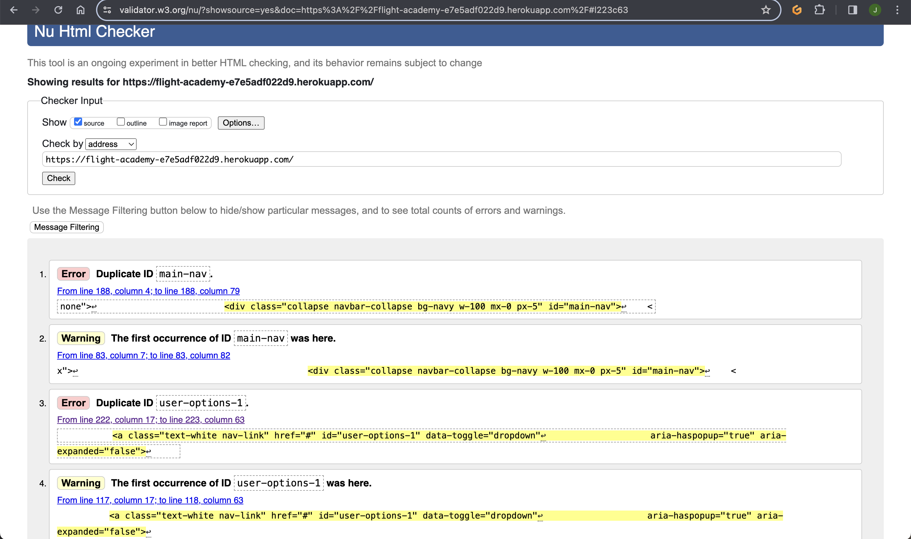 | Duplication of ID warnings related to separate navbar file |
| Training | [W3C](https://validator.w3.org/nu/?doc=https%3A%2F%2Fflight-academy-e7e5adf022d9.herokuapp.com%2Ftraining%2F) | 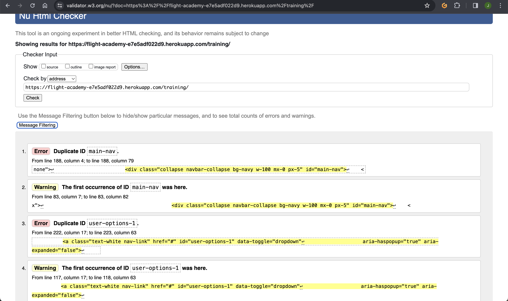 | Duplication of ID warnings related to separate navbar file |
| Training Details | [W3C](https://validator.w3.org/nu/?doc=https%3A%2F%2Fflight-academy-e7e5adf022d9.herokuapp.com%2Ftraining%2F2%2F) | 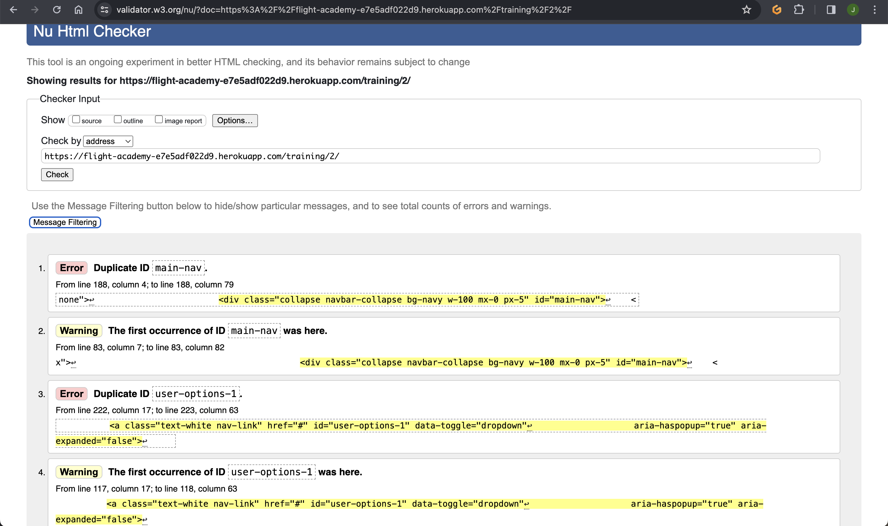 | Duplication of ID warnings related to separate navbar file |
| Add Training | [W3C](https://validator.w3.org/nu/?showsource=yes&doc=https%3A%2F%2Fflight-academy-e7e5adf022d9.herokuapp.com%2Faccounts%2Flogin%2F%3Fnext%3D%2Ftraining%2Fadd_training%2F#l288c69) |  | Duplication of ID warnings related to separate navbar file & trailing slash due to crispy forms |
| Edit Training | [W3C](https://validator.w3.org/nu/?doc=https%3A%2F%2Fflight-academy-e7e5adf022d9.herokuapp.com%2Faccounts%2Flogin%2F%3Fnext%3D%2Ftraining%2Fedit%2F2) | 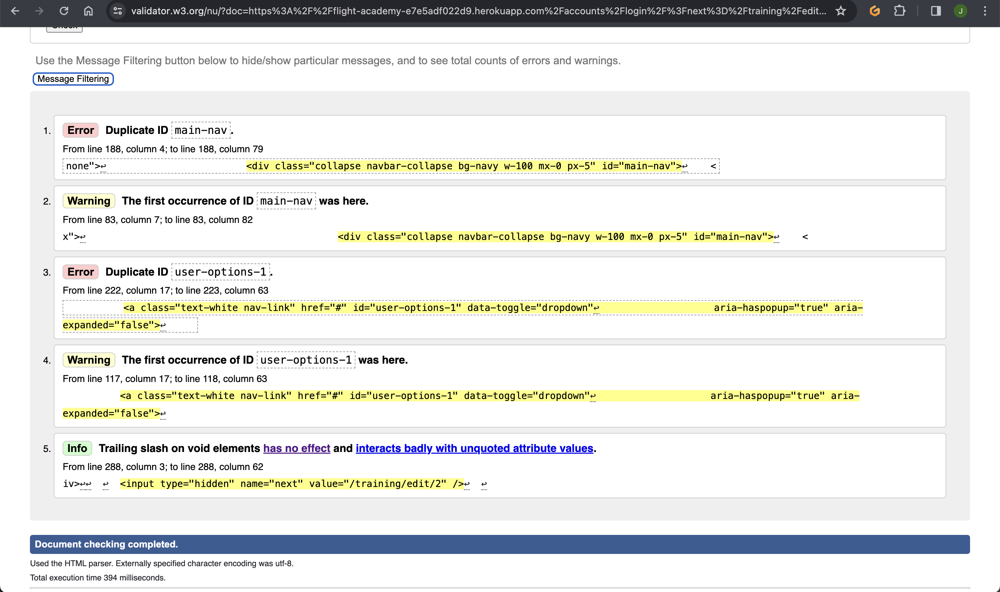 | Duplication of ID warnings related to separate navbar file & trailing slash due to crispy forms |
| Vouchers | [W3C](https://validator.w3.org/nu/?doc=https%3A%2F%2Fflight-academy-e7e5adf022d9.herokuapp.com%2Fvouchers%2F) | 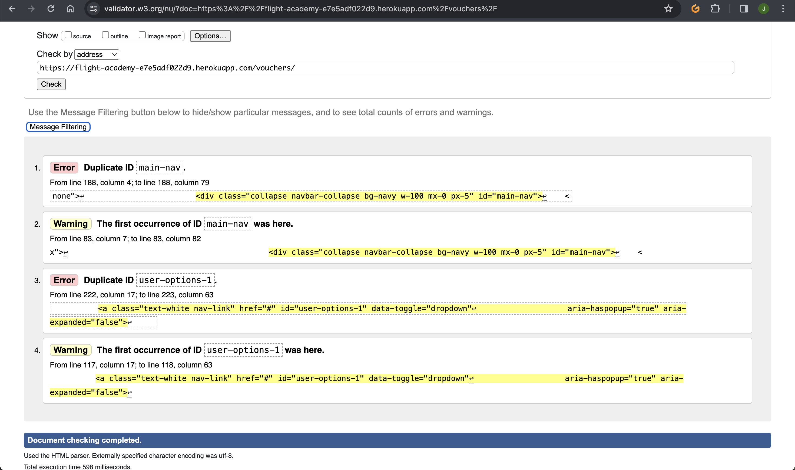 | Duplication of ID warnings related to separate navbar file |
| Voucher Details | [W3C](https://validator.w3.org/nu/?doc=https%3A%2F%2Fflight-academy-e7e5adf022d9.herokuapp.com%2Fvouchers%2F2%2F) | 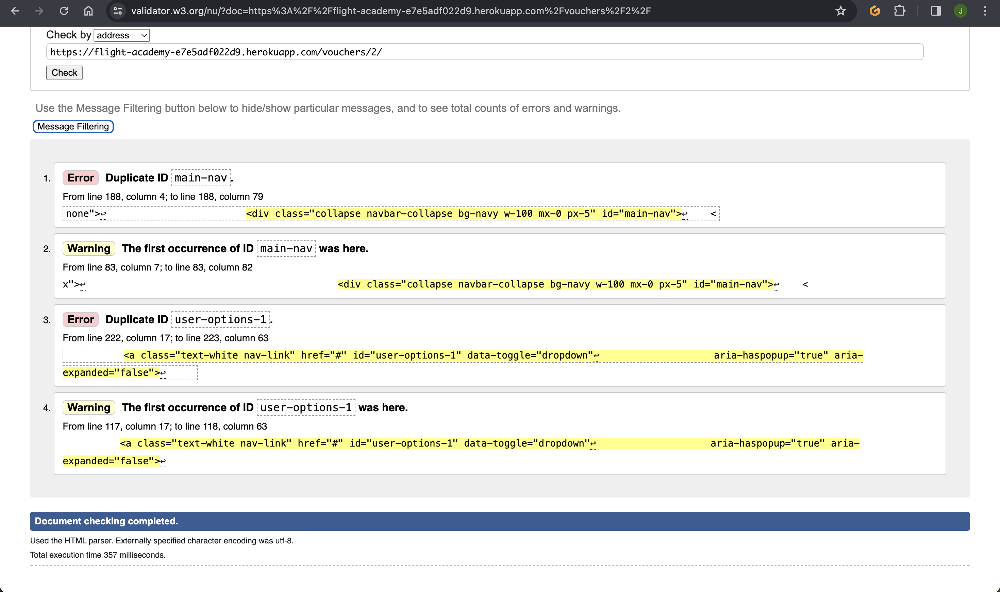 | Duplication of ID warnings related to separate navbar file |
| Add Voucher | [W3C](https://validator.w3.org/nu/?doc=https%3A%2F%2Fflight-academy-e7e5adf022d9.herokuapp.com%2Faccounts%2Flogin%2F%3Fnext%3D%2Fvouchers%2Fadd_voucher%2F) | 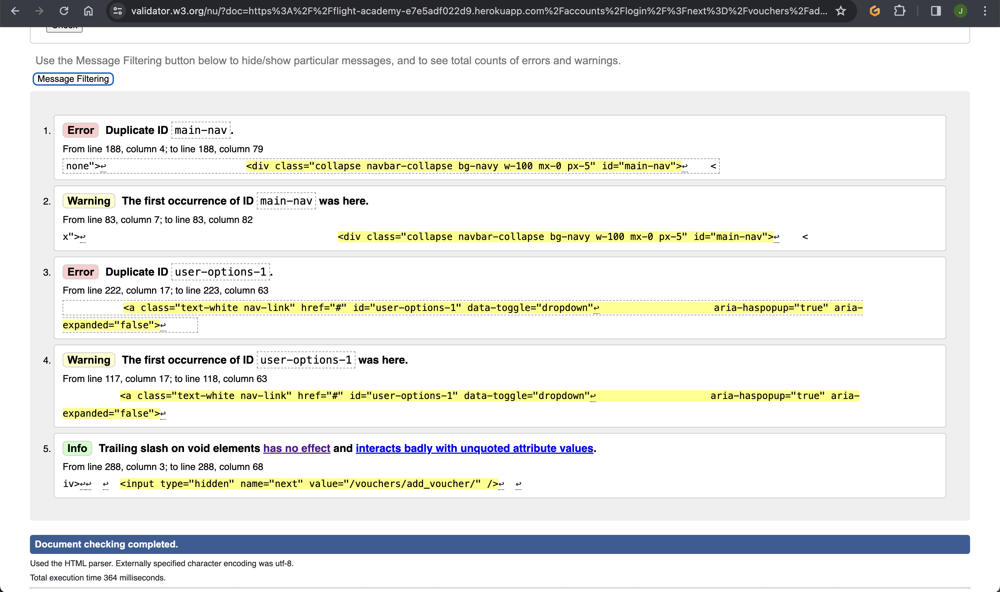 | Duplication of ID warnings related to separate navbar file & trailing slash due to crispy forms |
| Edit Voucher | [W3C](https://validator.w3.org/nu/?doc=https%3A%2F%2Fflight-academy-e7e5adf022d9.herokuapp.com%2Faccounts%2Flogin%2F%3Fnext%3D%2Fvouchers%2Fedit%2F2) | 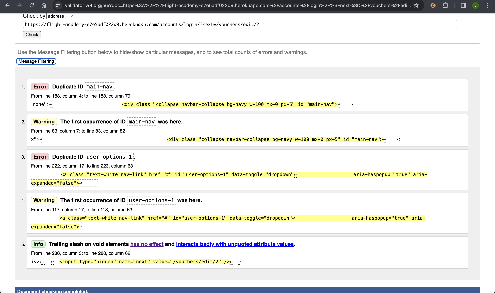 | Duplication of ID warnings related to separate navbar file & trailing slash due to crispy forms |
| About | [W3C](https://validator.w3.org/nu/?doc=https%3A%2F%2Fflight-academy-e7e5adf022d9.herokuapp.com%2Fabout%2F) | 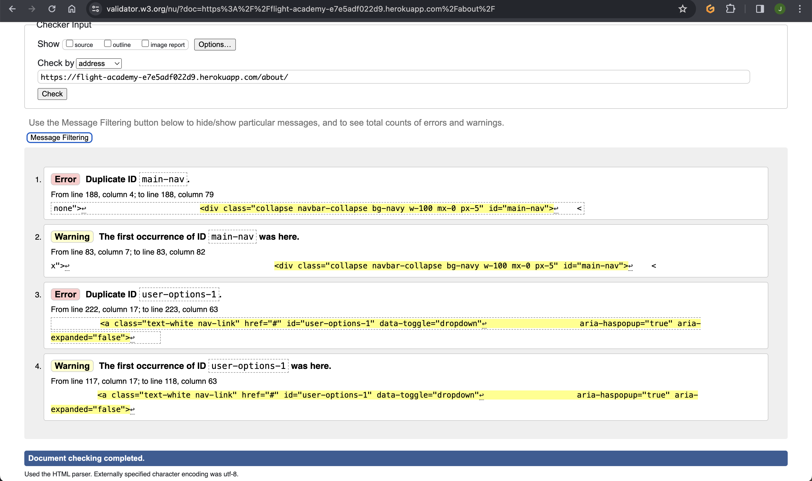 | Duplication of ID warnings related to separate navbar file |
| Contact Us | [W3C](https://validator.w3.org/nu/?doc=https%3A%2F%2Fflight-academy-e7e5adf022d9.herokuapp.com%2Fcontact%2F) | 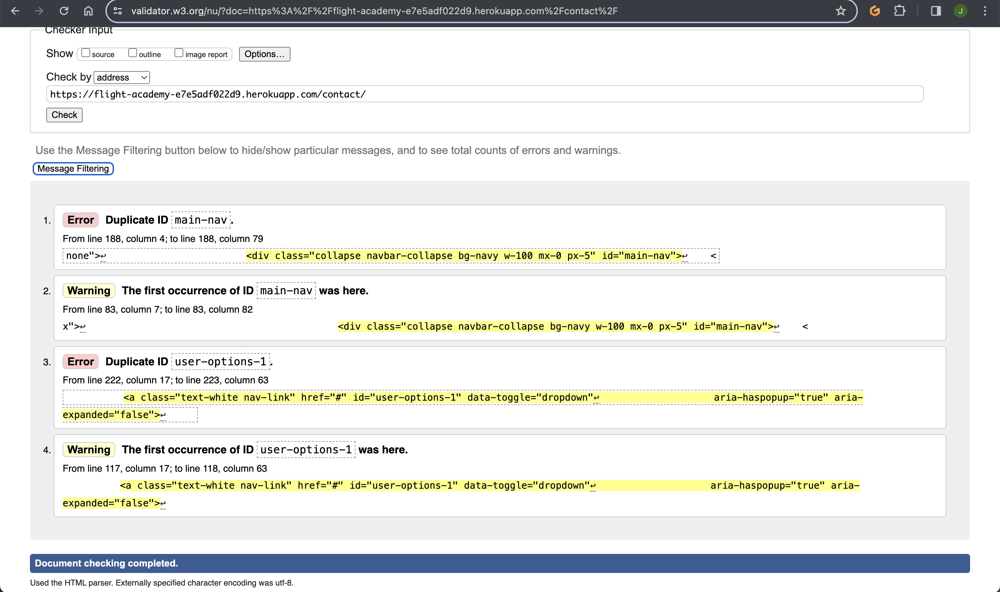 | Duplication of ID warnings related to separate navbar file |
| Shopping Bag | [W3C](https://validator.w3.org/nu/?doc=https%3A%2F%2Fflight-academy-e7e5adf022d9.herokuapp.com%2Fshopping_bag%2F) | 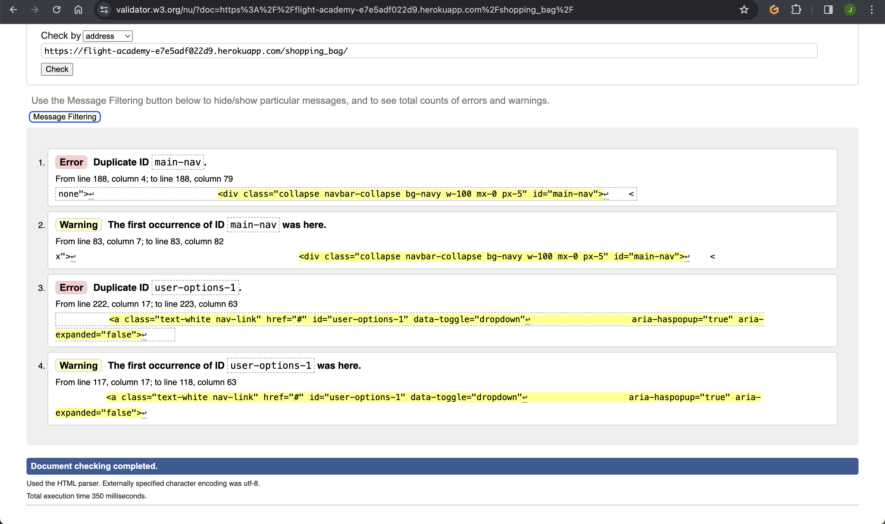 | Duplication of ID warnings related to separate navbar file |
| Payments | [W3C](https://validator.w3.org/nu/?showsource=yes&doc=https%3A%2F%2Fflight-academy-e7e5adf022d9.herokuapp.com%2Fpayments%2F) | 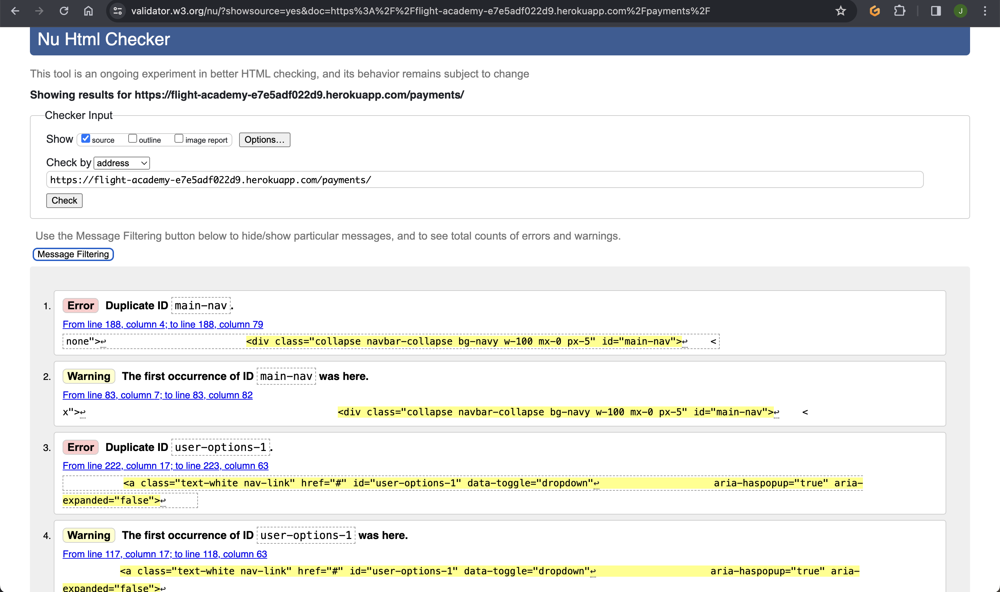 | Duplication of ID warnings related to separate navbar file |
| Payments Success | [W3C](https://validator.w3.org/nu/?doc=https%3A%2F%2Fflight-academy-e7e5adf022d9.herokuapp.com%2Fpayments%2Fpayments_success%2F825F88D40E09444CA6DD9B0F8356D6ED&showsource=yes) | 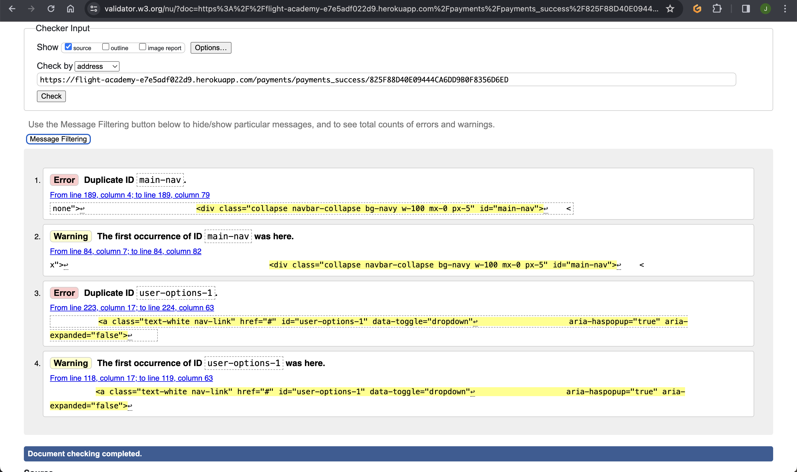 | Duplication of ID warnings related to separate navbar file |
| User Profile | [W3C](https://validator.w3.org/nu/?doc=https%3A%2F%2Fflight-academy-e7e5adf022d9.herokuapp.com%2Faccounts%2Flogin%2F%3Fnext%3D%2Fuser_profile%2F&showsource=yes) | 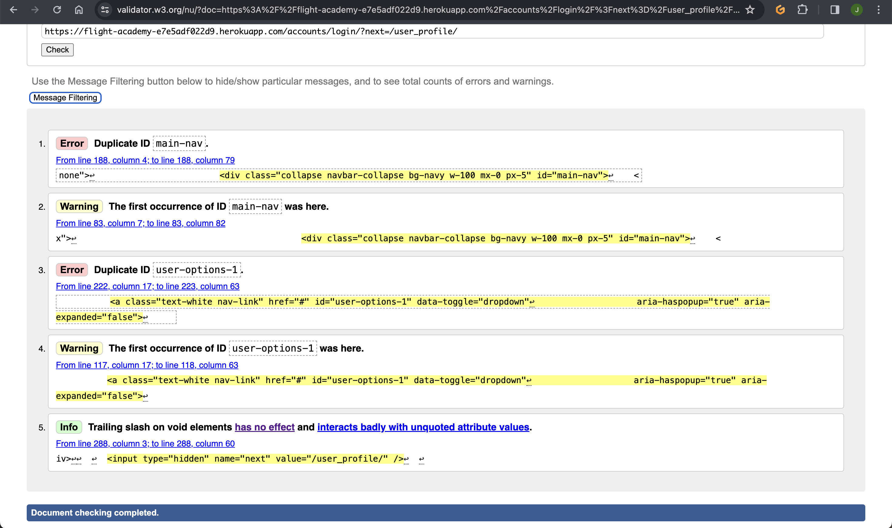 | Duplication of ID warnings related to separate navbar file & trailing slash due to allauth |
| Register | [W3C](https://validator.w3.org/nu/?doc=https%3A%2F%2Fflight-academy-e7e5adf022d9.herokuapp.com%2Faccounts%2Fsignup%2F&showsource=yes) | 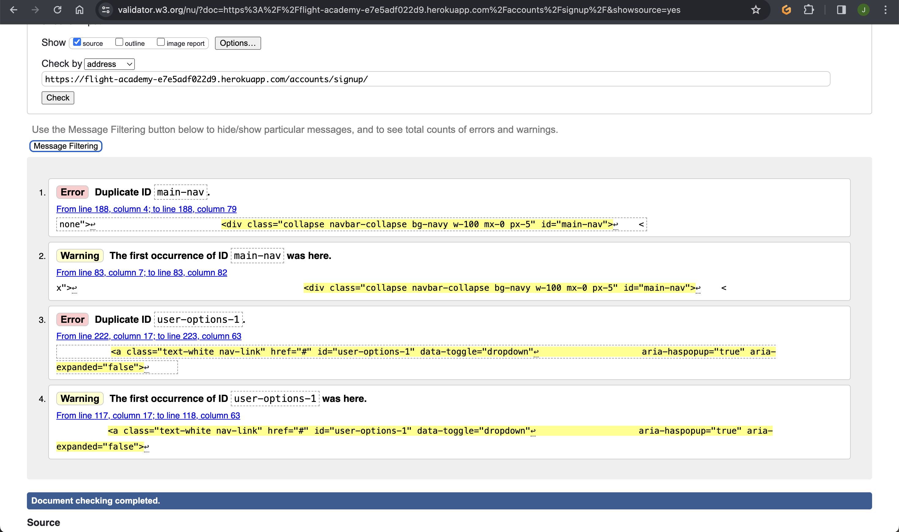 | Duplication of ID warnings related to separate navbar file |
| Signin | [W3C](https://validator.w3.org/nu/?doc=https%3A%2F%2Fflight-academy-e7e5adf022d9.herokuapp.com%2Faccounts%2Flogin%2F&showsource=yes) | 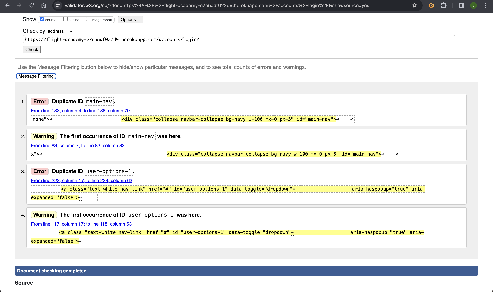 | Duplication of ID warnings related to separate navbar file |

<!-- 🛑🛑🛑🛑🛑 START OF NOTES (to be deleted) 🛑🛑🛑🛑🛑

**IMPORTANT**: Python/Jinja syntax in HTML

Python projects that use Jinja syntax, such as ``, ``, and `{{ variable|filter }}`
will not validate properly if you're copying/pasting into the HTML validator.

In order to properly validate these types of files, it's recommended to
[validate by uri](https://validator.w3.org/#validate_by_uri) from the deployed Heroku pages.

Unfortunately, pages that require a user to be logged-in and authenticated (CRUD functionality),
will not work using this method, due to the fact that the HTML Validator (W3C) doesn't have
access to login to your pages.
In order to properly validate HTML pages with Jinja syntax for authenticated pages, follow these steps:

- Navigate to the deployed pages which require authentication
- Right-click anywhere on the page, and select **View Page Source** (usually `CTRL+U` or `⌘+U` on Mac).
- This will display the entire "compiled" code, without any Jinja syntax.
- Copy everything, and use the [validate by input](https://validator.w3.org/#validate_by_input) method.
- Repeat this process for every page that requires a user to be logged-in/authenticated.

🛑🛑🛑🛑🛑 END OF NOTES (to be deleted) 🛑🛑🛑🛑🛑 -->

### CSS

I have used the recommended [CSS Jigsaw Validator](https://jigsaw.w3.org/css-validator) to validate all of my CSS files.

| File | Jigsaw URL | Screenshot | Notes |
| --- | --- | --- | --- |
| base.css | [Jigsaw](https://jigsaw.w3.org/css-validator/validator?uri=https%3A%2F%2Fflight-academy-e7e5adf022d9.herokuapp.com%2F&profile=css3svg&usermedium=all&warning=1&vextwarning=&lang=en) | 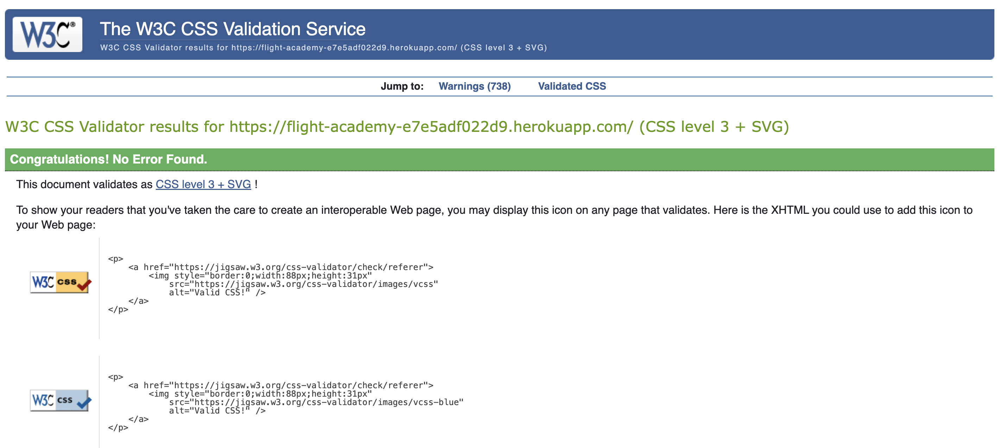 | Pass: No Errors |
| payments.css | n/a | 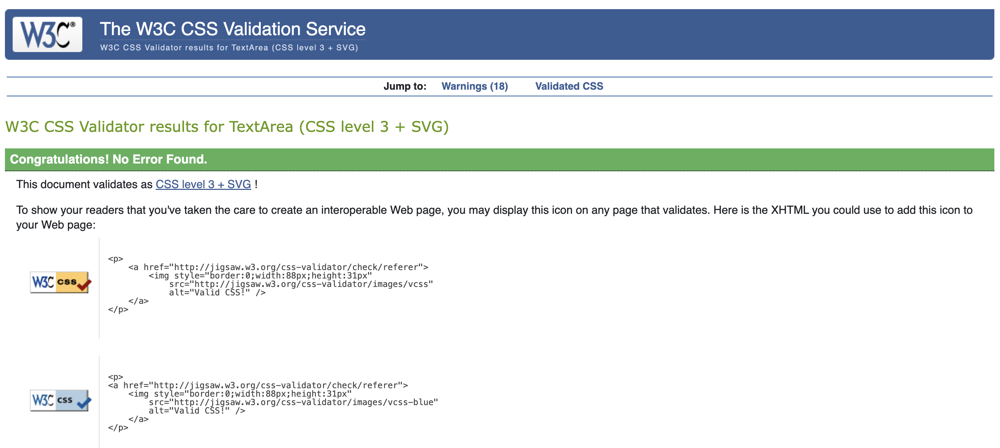 | Pass: No Errors |
| user_profile.css | n/a | 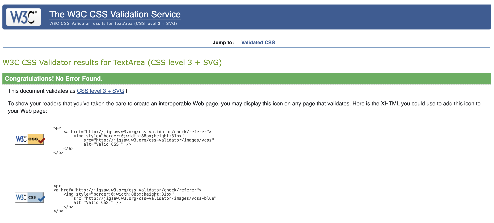 | Pass: No Errors |

### JavaScript

I have used the recommended [JShint Validator](https://jshint.com) to validate all of my JS files.

| File | Screenshot | Notes |
| --- | --- | --- |
| vouchers.html | 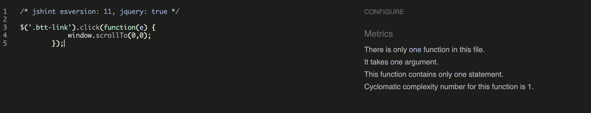 | Pass: No Errors |
| stripe_elements.js | 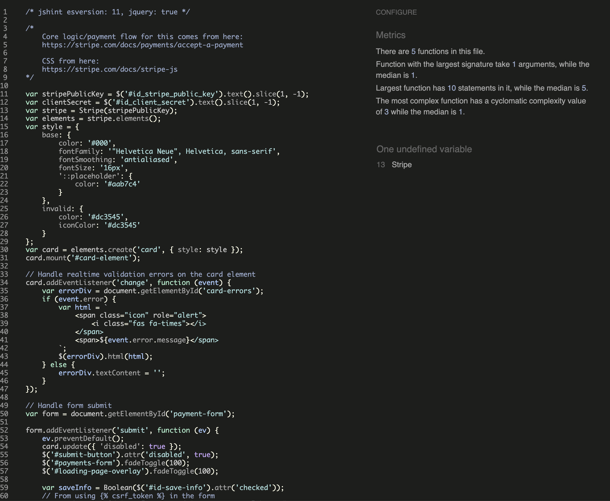 | Pass: No Errors |
| shopping_bag.html | 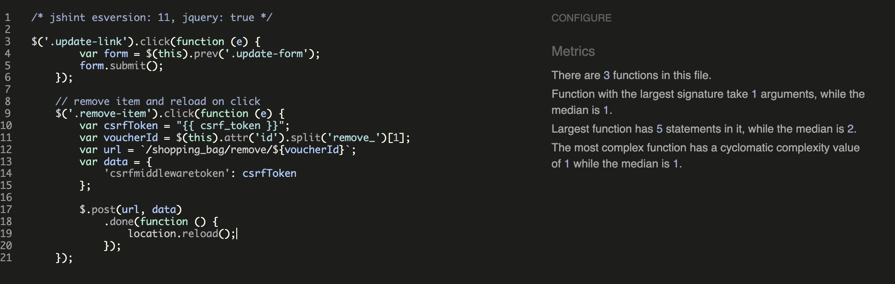 | Pass: No Errors |
| training.html | 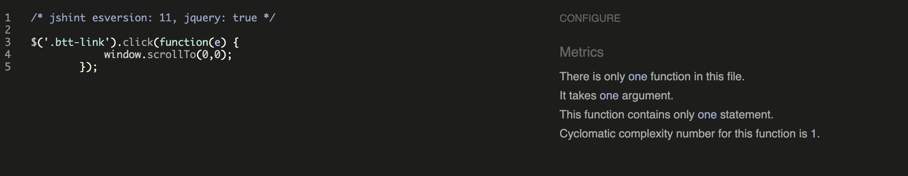 | Pass: No Errors |

### Python

I have used the recommended [PEP8 CI Python Linter](https://pep8ci.herokuapp.com) to validate all of my Python files.

| File | CI URL | Screenshot | Notes |
| --- | --- | --- | --- |
| About urls.py | [PEP8 CI](https://pep8ci.herokuapp.com/https://raw.githubusercontent.com/JamesH003/flight_academy/main/about/urls.py) | 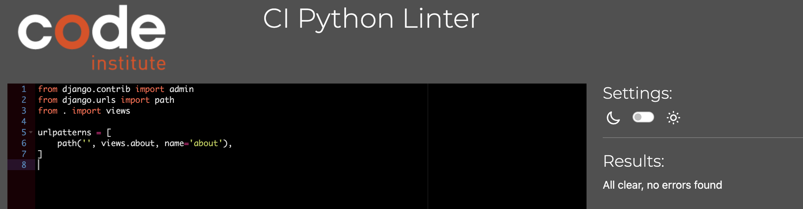 | Pass: No Errors |
| About views.py | [PEP8 CI](https://pep8ci.herokuapp.com/https://raw.githubusercontent.com/JamesH003/flight_academy/main/about/views.py) | 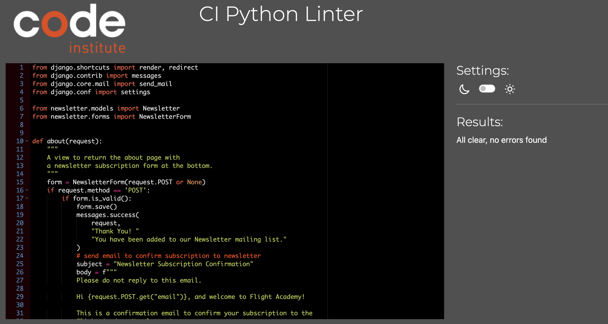 | Pass: No Errors |
| Contact admin.py | [PEP8 CI](https://pep8ci.herokuapp.com/https://raw.githubusercontent.com/JamesH003/flight_academy/main/contact/admin.py) |  | Pass: No Errors |
| Contact apps.py | [PEP8 CI](https://pep8ci.herokuapp.com/https://raw.githubusercontent.com/JamesH003/flight_academy/main/contact/apps.py) |  | Pass: No Errors |
| Contact forms.py | [PEP8 CI](https://pep8ci.herokuapp.com/https://raw.githubusercontent.com/JamesH003/flight_academy/main/contact/forms.py) | 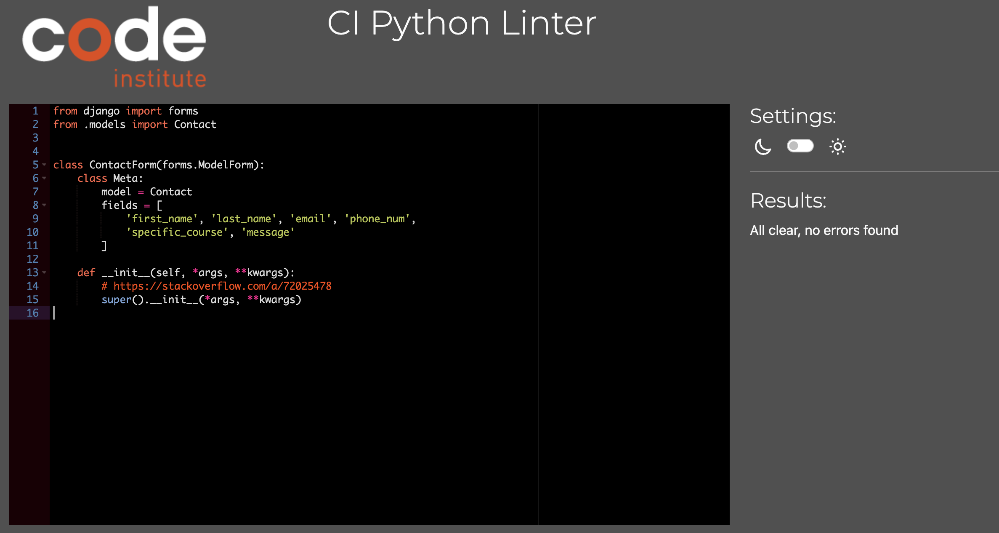 | Pass: No Errors |
| Contact models.py | [PEP8 CI](https://pep8ci.herokuapp.com/https://raw.githubusercontent.com/JamesH003/flight_academy/main/contact/models.py) | 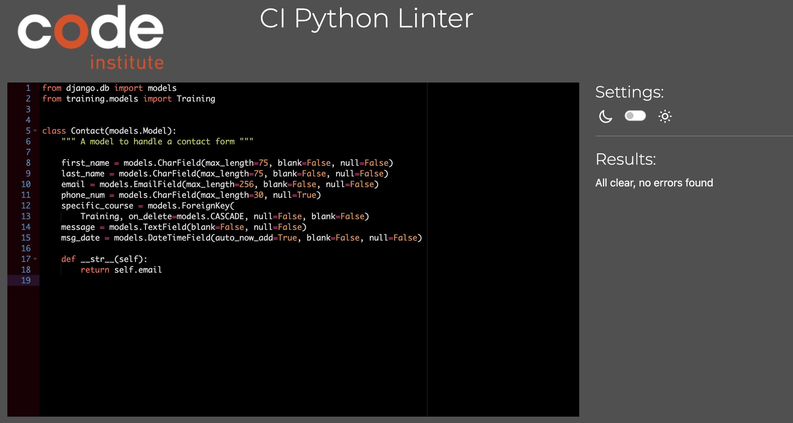 | Pass: No Errors |
| Contact urls.py | [PEP8 CI](https://pep8ci.herokuapp.com/https://raw.githubusercontent.com/JamesH003/flight_academy/main/contact/urls.py) | 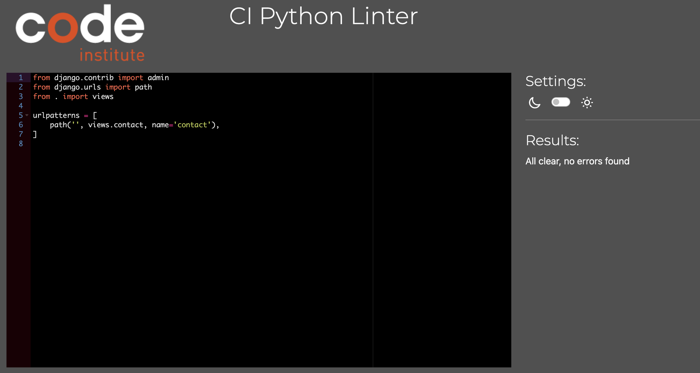 | Pass: No Errors |
| Contact views.py | [PEP8 CI](https://pep8ci.herokuapp.com/https://raw.githubusercontent.com/JamesH003/flight_academy/main/contact/views.py) | 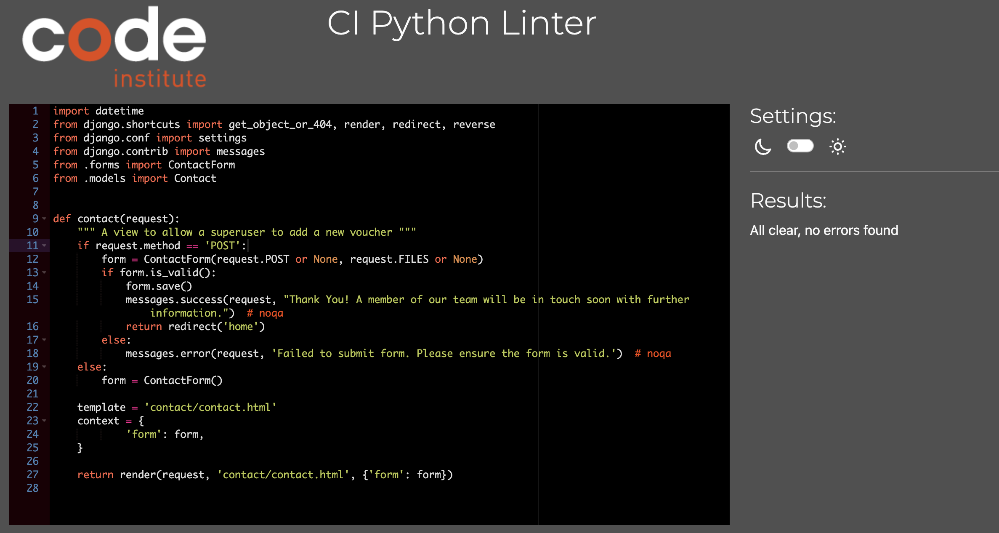 | Pass: No Errors |
| Flights admin.py | [PEP8 CI](https://pep8ci.herokuapp.com/https://raw.githubusercontent.com/JamesH003/flight_academy/main/flights/admin.py) | 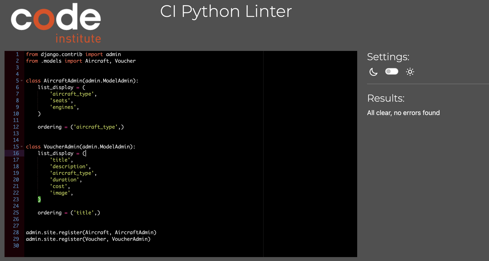 | Pass: No Errors |
| Flights apps.py | [PEP8 CI](https://pep8ci.herokuapp.com/https://raw.githubusercontent.com/JamesH003/flight_academy/main/flights/apps.py) | 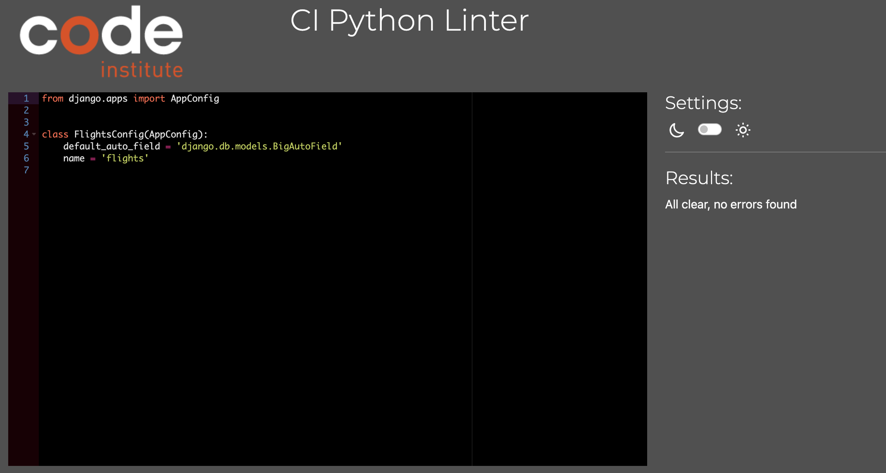 | Pass: No Errors |
| Flights forms.py | [PEP8 CI](https://pep8ci.herokuapp.com/https://raw.githubusercontent.com/JamesH003/flight_academy/main/flights/forms.py) | 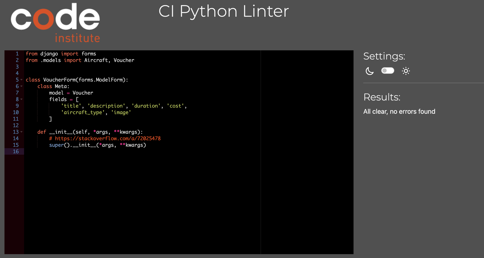 | Pass: No Errors |
| Flights models.py | [PEP8 CI](https://pep8ci.herokuapp.com/https://raw.githubusercontent.com/JamesH003/flight_academy/main/flights/models.py) | 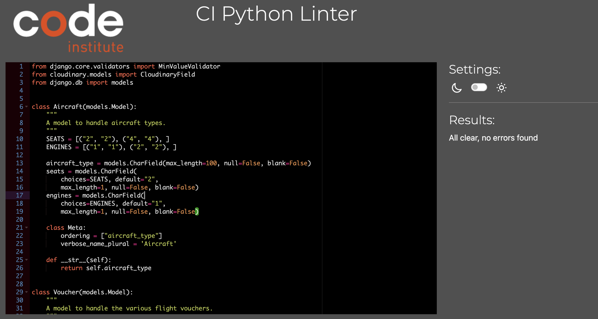 | Pass: No Errors |
| Flights urls.py | [PEP8 CI](https://pep8ci.herokuapp.com/https://raw.githubusercontent.com/JamesH003/flight_academy/main/flights/urls.py) | 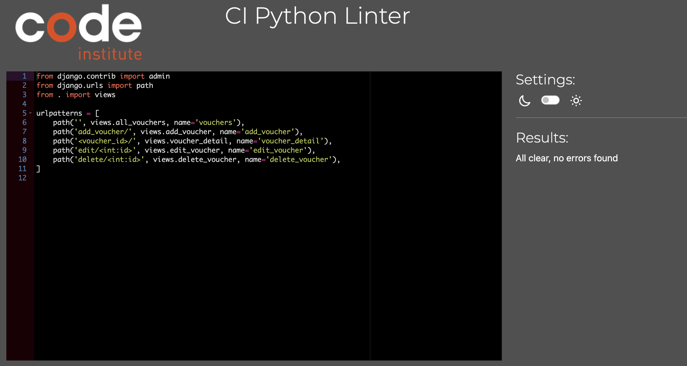 | Pass: No Errors |
| Flights views.py | [PEP8 CI](https://pep8ci.herokuapp.com/https://raw.githubusercontent.com/JamesH003/flight_academy/main/flights/views.py) | 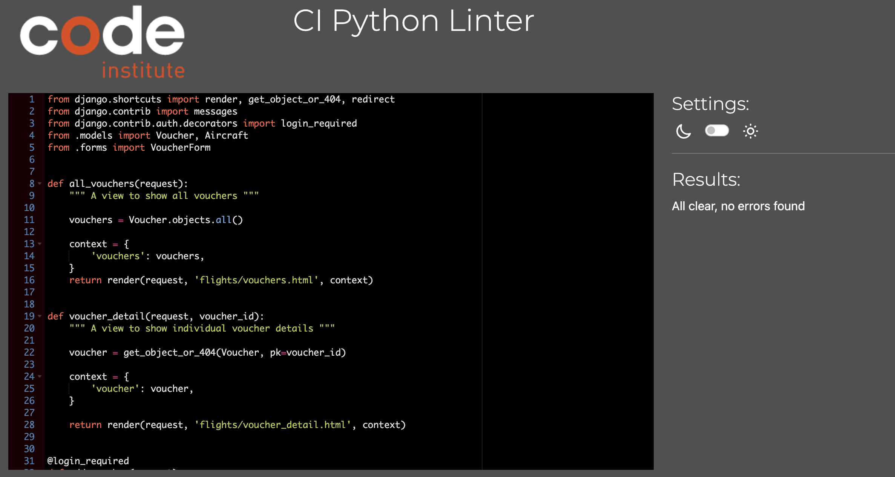 | Pass: No Errors |
| Home urls.py | [PEP8 CI](https://pep8ci.herokuapp.com/https://raw.githubusercontent.com/JamesH003/flight_academy/main/home/urls.py) | 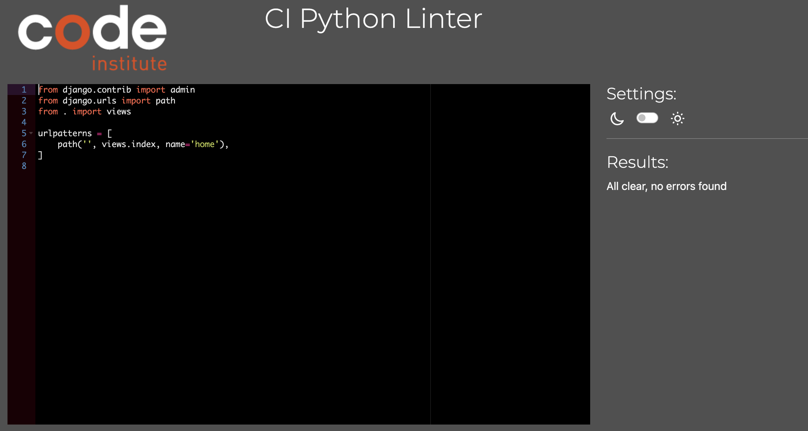 | Pass: No Errors |
| Home views.py | [PEP8 CI](https://pep8ci.herokuapp.com/https://raw.githubusercontent.com/JamesH003/flight_academy/main/home/views.py) | 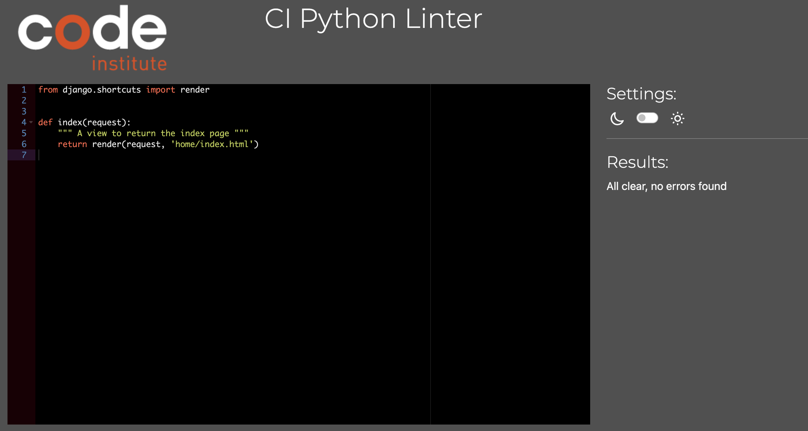 | Pass: No Errors |
| Newsletter admin.py | [PEP8 CI](https://pep8ci.herokuapp.com/https://raw.githubusercontent.com/JamesH003/flight_academy/main/newsletter/admin.py) | 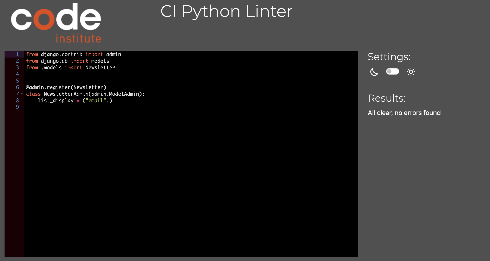 | Pass: No Errors |
| Newsletter forms.py | [PEP8 CI](https://pep8ci.herokuapp.com/https://raw.githubusercontent.com/JamesH003/flight_academy/main/newsletter/forms.py) | 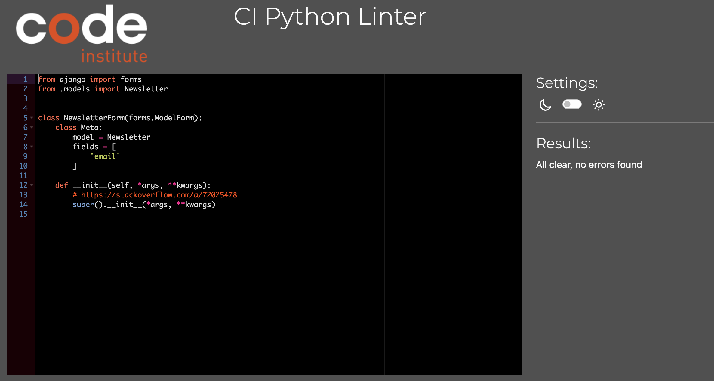 | Pass: No Errors |
| Newsletter models.py | [PEP8 CI](https://pep8ci.herokuapp.com/https://raw.githubusercontent.com/JamesH003/flight_academy/main/newsletter/models.py) | 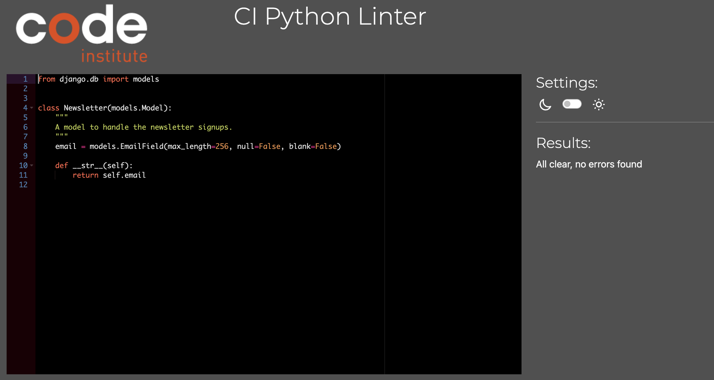 | Pass: No Errors |
| Newsletter urls.py | [PEP8 CI](https://pep8ci.herokuapp.com/https://raw.githubusercontent.com/JamesH003/flight_academy/main/newsletter/urls.py) | 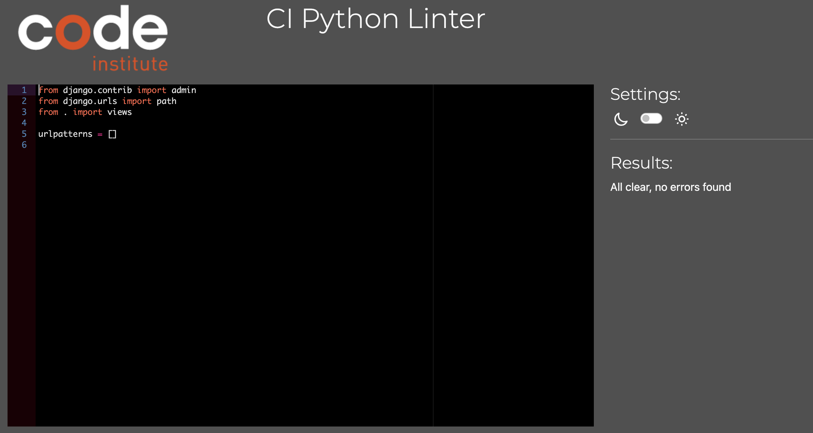 | Pass: No Errors |
| Payments admin.py | [PEP8 CI](https://pep8ci.herokuapp.com/https://raw.githubusercontent.com/JamesH003/flight_academy/main/payments/admin.py) | 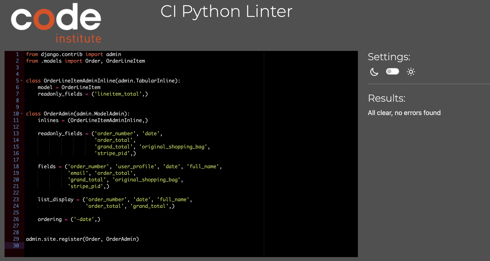 | Pass: No Errors |
| Payments apps.py | [PEP8 CI](https://pep8ci.herokuapp.com/https://raw.githubusercontent.com/JamesH003/flight_academy/main/payments/apps.py) | 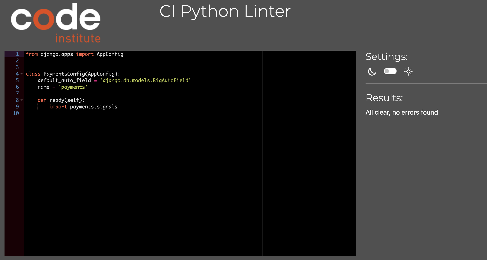 | Pass: No Errors |
| Payments forms.py | [PEP8 CI](https://pep8ci.herokuapp.com/https://raw.githubusercontent.com/JamesH003/flight_academy/main/payments/forms.py) | 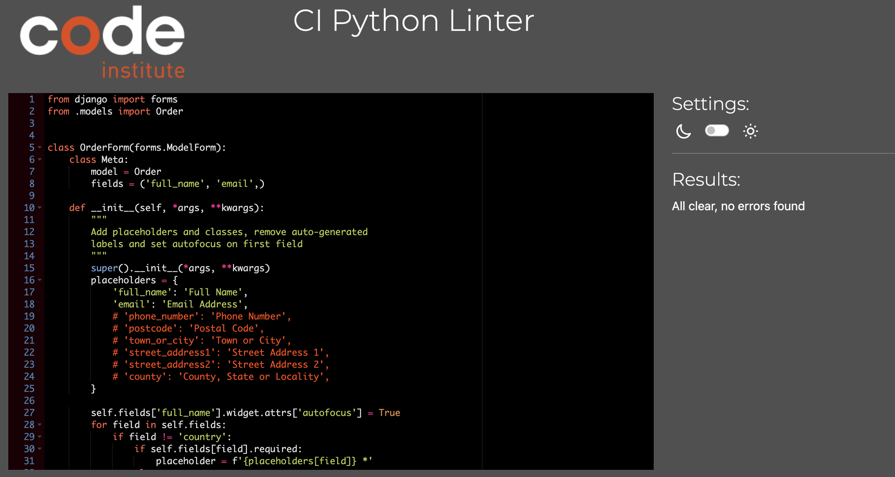 | Pass: No Errors |
| Payments models.py | [PEP8 CI](https://pep8ci.herokuapp.com/https://raw.githubusercontent.com/JamesH003/flight_academy/main/payments/models.py) | 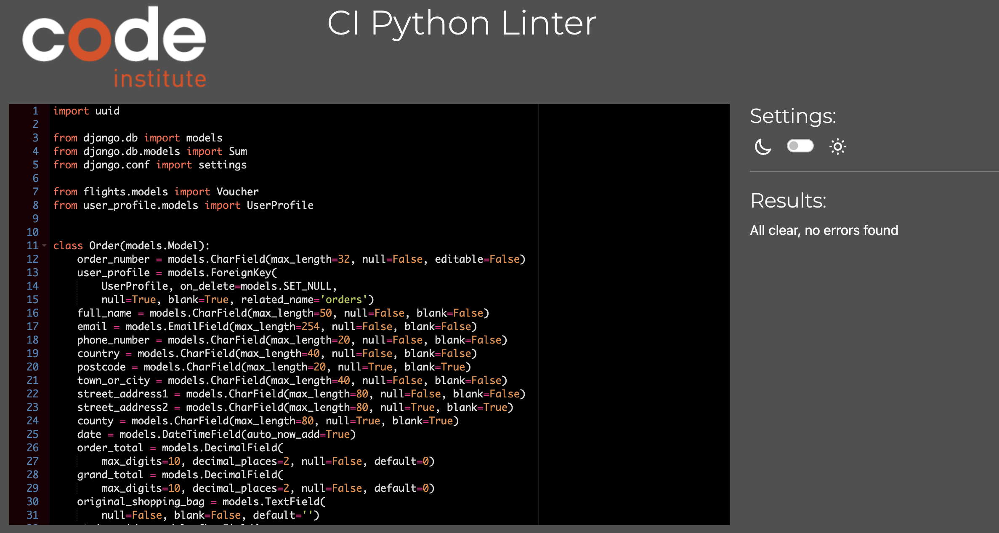 | Pass: No Errors |
| Payments signals.py | [PEP8 CI](https://pep8ci.herokuapp.com/https://raw.githubusercontent.com/JamesH003/flight_academy/main/payments/signals.py) | 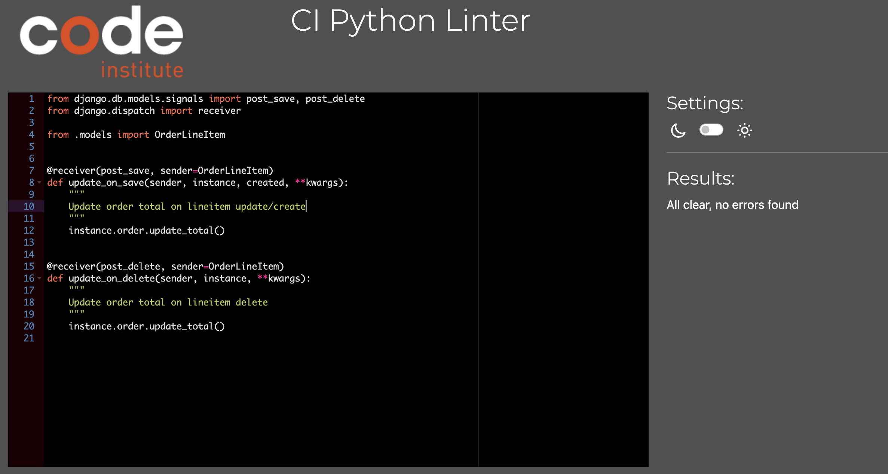 | Pass: No Errors |
| Payments urls.py | [PEP8 CI](https://pep8ci.herokuapp.com/https://raw.githubusercontent.com/JamesH003/flight_academy/main/payments/urls.py) | 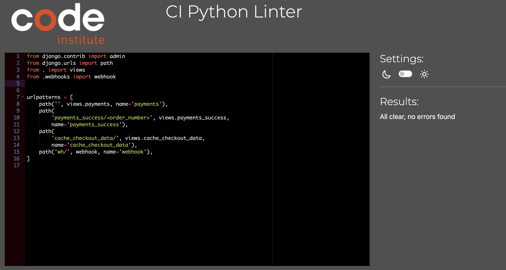 | Pass: No Errors |
| Payments views.py | [PEP8 CI](https://pep8ci.herokuapp.com/https://raw.githubusercontent.com/JamesH003/flight_academy/main/payments/views.py) | 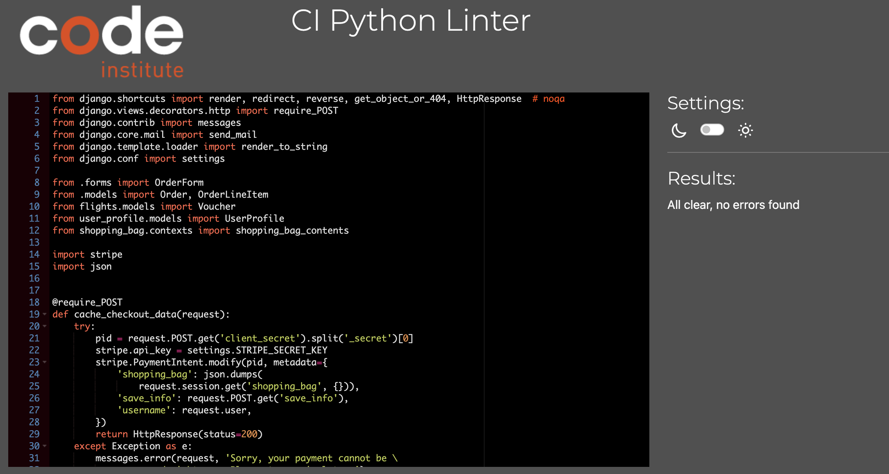 | Pass: No Errors |
| Shopping_bag bag_tools.py | [PEP8 CI](https://pep8ci.herokuapp.com/https://raw.githubusercontent.com/JamesH003/flight_academy/main/shopping_bag/templatetags/bag_tools.py) | 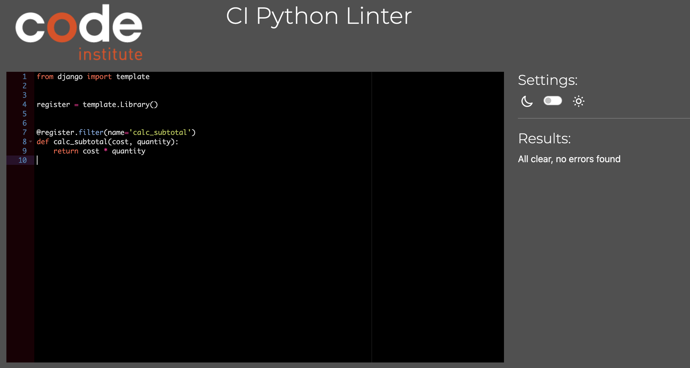 | Pass: No Errors |
| Shopping_bag contexts.py | [PEP8 CI](https://pep8ci.herokuapp.com/https://raw.githubusercontent.com/JamesH003/flight_academy/main/shopping_bag/contexts.py) | 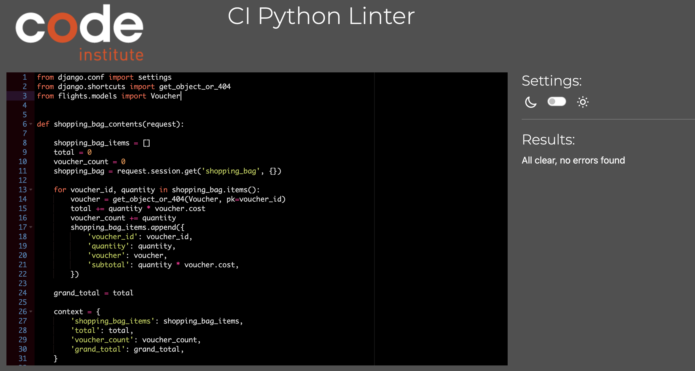 | Pass: No Errors |
| Shopping_bag urls.py | [PEP8 CI](https://pep8ci.herokuapp.com/https://raw.githubusercontent.com/JamesH003/flight_academy/main/shopping_bag/urls.py) |  | Pass: No Errors |
| Shopping_bag views.py | [PEP8 CI](https://pep8ci.herokuapp.com/https://raw.githubusercontent.com/JamesH003/flight_academy/main/shopping_bag/views.py) |  | Pass: No Errors |
| Training admin.py | [PEP8 CI](https://pep8ci.herokuapp.com/https://raw.githubusercontent.com/JamesH003/flight_academy/main/training/admin.py) |  | Pass: No Errors |
| Training forms.py | [PEP8 CI](https://pep8ci.herokuapp.com/https://raw.githubusercontent.com/JamesH003/flight_academy/main/training/forms.py) |  | Pass: No Errors |
| Training models.py | [PEP8 CI](https://pep8ci.herokuapp.com/https://raw.githubusercontent.com/JamesH003/flight_academy/main/training/models.py) |  | Pass: No Errors |
| Training urls.py | [PEP8 CI](https://pep8ci.herokuapp.com/https://raw.githubusercontent.com/JamesH003/flight_academy/main/training/urls.py) |  | Pass: No Errors |
| Training views.py | [PEP8 CI](https://pep8ci.herokuapp.com/https://raw.githubusercontent.com/JamesH003/flight_academy/main/training/views.py) |  | Pass: No Errors |
| User_profile models.py | [PEP8 CI](https://pep8ci.herokuapp.com/https://raw.githubusercontent.com/JamesH003/flight_academy/main/user_profile/models.py) |  | Pass: No Errors |
| User_profile urls.py | [PEP8 CI](https://pep8ci.herokuapp.com/https://raw.githubusercontent.com/JamesH003/flight_academy/main/user_profile/urls.py) |  | Pass: No Errors |
| User_profile views.py | [PEP8 CI](https://pep8ci.herokuapp.com/https://raw.githubusercontent.com/JamesH003/flight_academy/main/user_profile/views.py) |  | Pass: No Errors |
| flight_academy settings.py | [PEP8 CI](https://pep8ci.herokuapp.com/https://raw.githubusercontent.com/JamesH003/flight_academy/main/flight_academy/settings.py) |  | Pass: No Errors |
| flight_academy urls.py | [PEP8 CI](https://pep8ci.herokuapp.com/https://raw.githubusercontent.com/JamesH003/flight_academy/main/flight_academy/urls.py) |  | Pass: No Errors |
| flight_academy urls.py | [PEP8 CI](https://pep8ci.herokuapp.com/https://raw.githubusercontent.com/JamesH003/flight_academy/main/flight_academy/views.py) |  | Pass: No Errors |

## Browser Compatibility

I've tested my deployed project on multiple browsers to check for compatibility issues.

| Browser | Home | Training | Vouchers | About | Contact Us | Notes |
| --- | --- | --- | --- | --- | --- | --- |
| Chrome |  |  |  |  |  | Works as expected |
| Firefox |  |  |  |  |  | Works as expected |
| Edge |  |  |  |  |  | Works as expected |
| Safari |  |  |  |  |  | Works as expected |
| Brave |  |  |  |  |  | Works as expected |
| Opera |  |  |  |  |  | Works as expected |

## Responsiveness

I've tested my deployed project on multiple devices to check for responsiveness issues.

| Device | Home | Training | Vouchers | About | Contact | Notes |
| --- | --- | --- | --- | --- | --- | --- |
| Mobile (DevTools) |  |  |  |  |  | Works as expected |
| Tablet (DevTools) |  |  |  |  |  | Works as expected |
| Desktop |  |  |  |  |  | Works as expected |
| iPhone 11 |  |  |  |  |  | Works as expected |
| iPad |  |  |  |  |  | Last letter in training and vouchers cards wraps to next line |

## Lighthouse Audit

I've tested my deployed project using the Lighthouse Audit tool to check for any major issues.

| Page | Mobile | Desktop | Notes |
| --- | --- | --- | --- |
| Home |  |  | Some minor warnings |
| Training |  |  | Slow response time due to large images |
| Vouchers |  |  | Some minor warnings |
| About |  |  | Some minor warnings |
| Contact |  |  | Some minor warnings |
| Voucher Details |  |  | Some minor warnings |
| Training Details |  |  | Some minor warnings |
| Shopping Bag |  |  | Some minor warnings |
| Payments Success |  |  | Some minor warnings |
| Register |  |  | Some minor warnings |
| User Profile |  |  | Some minor warnings |

## Defensive Programming

<!-- 🛑🛑🛑🛑🛑 START OF NOTES (to be deleted) 🛑🛑🛑🛑🛑

Defensive programming (defensive design) is extremely important!

When building projects that accept user inputs or forms, you should always test the level of security for each.
Examples of this could include (not limited to):

Forms:
- Users cannot submit an empty form
- Users must enter valid email addresses

PP3 (Python-only):
- Users must enter a valid letter/word/string when prompted
- Users must choose from a specific list only

MS3 (Flask) | MS4/PP4/PP5 (Django):
- Users cannot brute-force a URL to navigate to a restricted page
- Users cannot perform CRUD functionality while logged-out
- User-A should not be able to manipulate data belonging to User-B, or vice versa
- Non-Authenticated users should not be able to access pages that require authentication
- Standard users should not be able to access pages intended for superusers

You'll want to test all functionality on your application, whether it's a standard form,
or uses CRUD functionality for data manipulation on a database.
Make sure to include the `required` attribute on any form-fields that should be mandatory.
Try to access various pages on your site as different user types (User-A, User-B, guest user, admin, superuser).

You should include any manual tests performed, and the expected results/outcome.

Testing should be replicable.
Ideally, tests cases should focus on each individual section of every page on the website.
Each test case should be specific, objective, and step-wise replicable.

Instead of adding a general overview saying that everything works fine,
consider documenting tests on each element of the page
(ie. button clicks, input box validation, navigation links, etc.) by testing them in their happy flow,
and also the bad/exception flow, mentioning the expected and observed results,
and drawing a parallel between them where applicable.

Consider using the following format for manual test cases:

Expected Outcome / Test Performed / Result Received / Fixes Implemented

- **Expected**: "Feature is expected to do X when the user does Y."
- **Testing**: "Tested the feature by doing Y."
- (either) **Result**: "The feature behaved as expected, and it did Y."
- (or) **Result**: "The feature did not respond to A, B, or C."
- **Fix**: "I did Z to the code because something was missing."

Use the table below as a basic start, and expand on it using the logic above.

🛑🛑🛑🛑🛑 END OF NOTES (to be deleted) 🛑🛑🛑🛑🛑 -->

Defensive programming was manually tested with the below user acceptance testing:

| Page | Expectation | Test | Result | Fix | Screenshot |
| --- | --- | --- | --- | --- | --- |
| Training | | | | | |
| | From the training page a user should be able to view the training courses, but not add new ones, unless the user is a superuser | Tested the feature by logging in as a non-superuser | The feature behaved as expected, and the Add Training Course button was not displayed | Test concluded and passed |  |
| | From the training page a user should be able to view the training courses, but not add new ones, unless the user is a superuser | Tested the feature by logging in as a non-superuser and trying to access the page through the add_training url directly | The feature behaved as expected, and a 500 error page was displayed with a warning toast | Test concluded and passed |  |
| | From the training page a user should be able to view the training courses, but not add new ones, unless the user is a superuser | Tested the feature by not logging in at all and trying to access the page through the add_training url directly | The feature behaved as expected, and displayed the Signin page | Test concluded and passed |  |
| | From the training page a user should be able to view the training courses, but not edit or delete, unless the user is a superuser | Tested the feature by not logging in at all and trying to access the page through the edit url directly | The feature behaved as expected, and displayed the Signin page | Test concluded and passed |  |
| | From the training details page a user should be able to view the training courses, but not edit or delete, unless the user is a superuser | Tested the feature by logging in as a non-superuser | The feature behaved as expected, and the Edit and Delete buttons were not displayed | Test concluded and passed |  |
| | From the training details page a superuser should not be able to delete a training courses without a warning modal to confirm their decision. | Tested the feature by logging in as a superuser and clicking delete | The feature behaved as expected, and the Delete modal was displayed | Test concluded and passed |  |
| | From the training details page a user should be able to view the training courses, but not edit or delete, unless the user is a superuser | Tested the feature by logging in as a non-superuser and trying to access the page through the edit url directly | The feature behaved as expected, and the edit page was not accessed and a warning toast was displayed | Test concluded and passed |  |
| Vouchers | | | | | |
| | From the vouchers page a user should be able to view the vouchers, but not add new ones, unless the user is a superuser | Tested the feature by logging in as a non-superuser | The feature behaved as expected, and the Add Voucher button was not displayed | Test concluded and passed |  |
| | From the vouchers page a user should be able to view the vouchers, but not add new ones, unless the user is a superuser | Tested the feature by logging in as a non-superuser and trying to access the page through the add_voucher url directly | The feature behaved as expected, and a 500 error page was displayed with a warning toast | Test concluded and passed |  |
| | From the vouchers page a user should be able to view the vouchers, but not add new ones, unless the user is a superuser | Tested the feature by not logging in at all and trying to access the page through the add_voucher url directly | The feature behaved as expected, and displayed the Signin page | Test concluded and passed |  |
| | From the vouchers page a user should be able to view the vouchers, but not Edit or Delete, unless the user is a superuser | Tested the feature by not logging in at all and trying to access the page through the edit url directly | The feature behaved as expected, and displayed the Signin page | Test concluded and passed |  |
| | From the voucher details page a user should be able to view the voucher details, but not edit or delete, unless the user is a superuser | Tested the feature by logging in as a non-superuser | The feature behaved as expected, and the Edit and Delete buttons were not displayed | Test concluded and passed |  |
| | From the voucher details page a superuser should not be able to delete a voucher without a warning modal to confirm their decision. | Tested the feature by logging in as a superuser and clicking delete | The feature behaved as expected, and the Delete modal was displayed | Test concluded and passed |  |
| | From the voucher details page a user should be able to view the vouchers, but not edit or delete, unless the user is a superuser | Tested the feature by logging in as a non-superuser and trying to access the page through the edit url directly | The feature behaved as expected, and the edit page was not accessed and a warning toast was displayed | Test concluded and passed |  |
| User Profile | | | | | |
| | A user should only be able to view their user profile and order history when they're logged in. | Tested the feature by not logging in and trying to access the page using the user_profile url | The feature behaved as expected, and the Signin page was displayed | Test concluded and passed |  |
| | A user should only be able to view their user profile and order history when they're logged in. | Tested the feature by not logging in and trying to access the page using account dropdown menu in the navbar. | The feature behaved as expected, and the Profile link was not displayed | Test concluded and passed |  |
| Newsletter | | | | | |
| | To sign up for the newsletter, a user should not be able to submit a blank form | Tested the feature by leaving the email input field black and clicking submit | The feature behaved as expected and an error message appeared requesting the user fill in the field. | Test concluded and passed |  |
| Payments | | | | | |
| | To complete the payment flow users shouldn't be able to leave input fields blank | Tested the feature by leaving the input fields blank and clicking Complete Order | The feature behaved as expected and an error message appeared requesting the user fill in the fields. | Test concluded and passed |  |
| | To complete the payment flow users shouldn't be able to leave card input blank | Tested the feature by leaving the input field blank and clicking Complete Order | The feature behaved as expected and an error message appeared stating that the card number is incomplete. | Test concluded and passed |  |

## User Story Testing

| User Story | Screenshot |
| --- | --- |
| As a new site user, I would like to view a list of products, so that I can decide which one to purchese. |  |
| As a new site user, I would like to view individual product details, so that I can decide which one I want to purchase. |  |
| As a new site user, I would like to clearly see the types of products available, so that I can select the appropriate one. |  |
| As a new site user, I would like to easily add a product to my shopping bag, so that I can purchase the product. |  |
| As a new site user, I would like to view the items in my bag to be purchased, so that I can know which products I have selected. |  |
| As a new site user, I would like to adjust the quantity of products in my bag, so that I can increase or decrease the number of products I want to purchase. |  |
| As a new site user, I would like to easily view the total price of my purchases, so that I can stay aware of my spending. |  |
| As a new site user, I would like to easily enter my payment information, so that I can pay for my chosen products with great ease. |  |
| As a new site user, I would like to view an order confirmation after checkout, so that I can have a record of what I have ordered. |  |
| As a new site user, I would like to receive an email confirmation, so that I can have proof of purchase. |  |
| As a new site user, I would like to subscribe to a newsletter, so that I can get more information. |  |
| As a new site user, I would like to view different training courses, so that I can assess my options. |  |
| As a returning site user, I would like to register an account, so that I can have a personal account. |  |
| As a returning site user, I would like to login to my account, so that I can access my personal account. |  |
| As a returning site user, I would like to logout of my account, so that I can logout of my personal account. |  |
| As a returning site user, I would like to recover my password, so that I can regain access to my account. |  |
| As a returning site user, I would like to know my information is secure, so that I can be confident in entering my payment information. |  |
| As a returning site user, I would like to access links to social media pages, so that I can view their social media content. |  |
| As a site administrator, I should be able to add new products to the store, so that I can increase the amount of products on offer. |  |
| As a site administrator, I should be able to edit or update products, so that I can keep the product information up to date. |  |
| As a site administrator, I should be able to delete products from the store, so that I can remove products that are no longer for sale. |  |
| As a site administrator, I should be able to add new training course options, so that I can improve what the site has to offer. |  |
| As a site administrator, I should be able to edit training courses, so that I can change certain aspects as needs be. |  |
| As a site administrator, I should be able to delete training courses, so that I can remove courses that are no longer available. |  |

## Bugs

- Background image not displaying on deployed site through Heroku

    

    - I originally had my css code as per the screenshot above. To fix this, I contacted tutor support and was advised by a tutor to hard-code the URL. Although this isn't an ideal solution, it got the job done. I intend to revisit this when I have more time to do it properly.

    

- Test flowing onto next line on Samsung mobile screens

    
    

    - To fix this, I removed the Bootstrap display-4 class and replaced it with a custom CSS class and reduced font size.

- Line too long error in Python testing

    

    - To fix this, I added # noqa to the end of the line as it was a string.

- Commit messages starting with lowercase letter.

    

    - From following along with the walkthrough Boutique Ado lessons, I followed suit with regard to my commit messages and used lowercase letters for the first few weeks of my project. Upon realising my error, I reverted to beginning my commit message with capital letters.

## Unfixed Bugs

<!-- 🛑🛑🛑🛑🛑 START OF NOTES (to be deleted) 🛑🛑🛑🛑🛑

You will need to mention unfixed bugs and why they were not fixed.
This section should include shortcomings of the frameworks or technologies used.
Although time can be a big variable to consider, paucity of time and difficulty understanding
implementation is not a valid reason to leave bugs unfixed.

If you've identified any unfixed bugs, no matter how small, be sure to list them here.
It's better to be honest and list them, because if it's not documented and an assessor finds the issue,
they need to know whether or not you're aware of them as well, and why you've not corrected/fixed them.

Some examples:

🛑🛑🛑🛑🛑 END OF NOTES (to be deleted) 🛑🛑🛑🛑🛑 -->

- On devices smaller than 375px, the page starts to have `overflow-x` scrolling.

    

    - Attempted fix: I tried to add additional media queries to handle this, but things started becoming too small to read.

- For PP3, when using a helper `clear()` function, any text above the height of the terminal does not clear, and remains when you scroll up.

    

    - Attempted fix: I tried to adjust the terminal size, but it only resizes the actual terminal, not the allowable area for text.

- When validating HTML with a semantic `section` element, the validator warns about lacking a header `h2-h6`. This is acceptable.

    

    - Attempted fix: this is a known warning and acceptable, and my section doesn't require a header since it's dynamically added via JS.

There are no remaining bugs that I am aware of.
