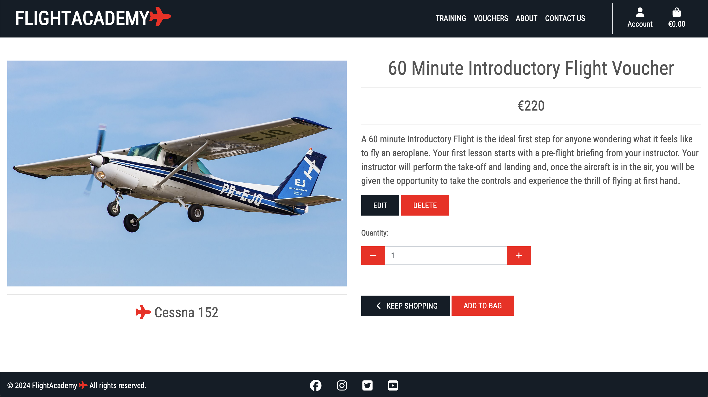
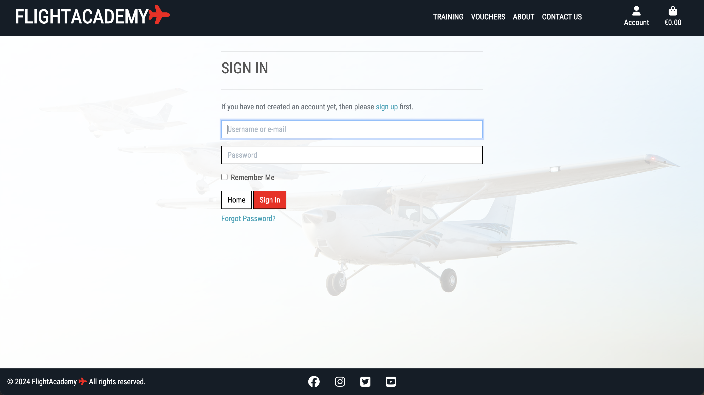

# Testing

Return back to the [README.md](README.md) file.

## Code Validation

### HTML

I have used the recommended [HTML W3C Validator](https://validator.w3.org) to validate all of my HTML files.

| Page | W3C URL | Screenshot | Notes |
| --- | --- | --- | --- |
| Home | [W3C](https://validator.w3.org/nu/?doc=https%3A%2F%2Fflight-academy-e7e5adf022d9.herokuapp.com%2F) |  | Pass: No Errors |
| Training | [W3C](https://validator.w3.org/nu/?doc=https%3A%2F%2Fflight-academy-e7e5adf022d9.herokuapp.com%2Ftraining%2F) |  | Pass: No Errors |
| Training Details | [W3C](https://validator.w3.org/nu/?doc=https%3A%2F%2Fflight-academy-e7e5adf022d9.herokuapp.com%2Ftraining%2F2%2F) |  | Pass: No Errors |
| Add Training | [W3C](https://validator.w3.org/nu/?doc=https%3A%2F%2Fflight-academy-e7e5adf022d9.herokuapp.com%2Faccounts%2Flogin%2F%3Fnext%3D%2Ftraining%2Fadd_training%2F) |  | Pass: No Errors |
| Edit Training | [W3C](https://validator.w3.org/nu/?doc=https%3A%2F%2Fflight-academy-e7e5adf022d9.herokuapp.com%2Faccounts%2Flogin%2F%3Fnext%3D%2Ftraining%2Fedit%2F2) |  | Pass: No Errors |
| Vouchers | [W3C](https://validator.w3.org/nu/?doc=https%3A%2F%2Fflight-academy-e7e5adf022d9.herokuapp.com%2Fvouchers%2F) |  | Pass: No Errors |
| Voucher Details | [W3C](https://validator.w3.org/nu/?doc=https%3A%2F%2Fflight-academy-e7e5adf022d9.herokuapp.com%2Fvouchers%2F2%2F) |  | Pass: No Errors |
| Add Voucher | [W3C](https://validator.w3.org/nu/?doc=https%3A%2F%2Fflight-academy-e7e5adf022d9.herokuapp.com%2Faccounts%2Flogin%2F%3Fnext%3D%2Fvouchers%2Fadd_voucher%2F) |  | Pass: No Errors |
| Edit Voucher | [W3C](https://validator.w3.org/nu/?doc=https%3A%2F%2Fflight-academy-e7e5adf022d9.herokuapp.com%2Faccounts%2Flogin%2F%3Fnext%3D%2Fvouchers%2Fedit%2F2) |  | Pass: No Errors |
| About | [W3C](https://validator.w3.org/nu/?doc=https%3A%2F%2Fflight-academy-e7e5adf022d9.herokuapp.com%2Fabout%2F) |  | Pass: No Errors |
| Contact Us | [W3C](https://validator.w3.org/nu/?doc=https%3A%2F%2Fflight-academy-e7e5adf022d9.herokuapp.com%2Fcontact%2F) |  | Pass: No Errors |
| Shopping Bag | [W3C](https://validator.w3.org/nu/?doc=https%3A%2F%2Fflight-academy-e7e5adf022d9.herokuapp.com%2Fshopping_bag%2F) |  | Pass: No Errors |
| Payments | [W3C](https://validator.w3.org/nu/?doc=https%3A%2F%2Fflight-academy-e7e5adf022d9.herokuapp.com%2Fpayments%2F) |  | Pass: No Errors |
| Payments Success | [W3C](https://validator.w3.org/nu/?doc=https%3A%2F%2Fflight-academy-e7e5adf022d9.herokuapp.com%2Fpayments%2Fpayments_success%2F2572C7422886421CA53DCE51AA4A783D) |  | Pass: No Errors |
| User Profile | [W3C](https://validator.w3.org/nu/?doc=https%3A%2F%2Fflight-academy-e7e5adf022d9.herokuapp.com%2Faccounts%2Flogin%2F%3Fnext%3D%2Fuser_profile%2F) |  | Pass: No Errors |
| Register | [W3C](https://validator.w3.org/nu/?doc=https%3A%2F%2Fflight-academy-e7e5adf022d9.herokuapp.com%2Faccounts%2Fsignup%2F) |  | Pass: No Errors |
| Signin | [W3C](https://validator.w3.org/nu/?doc=https%3A%2F%2Fflight-academy-e7e5adf022d9.herokuapp.com%2Faccounts%2Flogin%2F) |  | Pass: No Errors |

### CSS

I have used the recommended [CSS Jigsaw Validator](https://jigsaw.w3.org/css-validator) to validate all of my CSS files.

| File | Jigsaw URL | Screenshot | Notes |
| --- | --- | --- | --- |
| base.css | [Jigsaw](https://jigsaw.w3.org/css-validator/validator?uri=https%3A%2F%2Fflight-academy-e7e5adf022d9.herokuapp.com%2F&profile=css3svg&usermedium=all&warning=1&vextwarning=&lang=en) |  | Pass: No Errors |
| payments.css | n/a |  | Pass: No Errors |
| user_profile.css | n/a |  | Pass: No Errors |

### JavaScript

I have used the recommended [JShint Validator](https://jshint.com) to validate all of my JS files.

| File | Screenshot | Notes |
| --- | --- | --- |
| vouchers.html |  | Pass: No Errors |
| stripe_elements.js |  | Pass: No Errors |
| shopping_bag.html |  | Pass: No Errors |
| training.html |  | Pass: No Errors |

### Python

I have used the recommended [PEP8 CI Python Linter](https://pep8ci.herokuapp.com) to validate all of my Python files.

| File | CI URL | Screenshot | Notes |
| --- | --- | --- | --- |
| About urls.py | [PEP8 CI](https://pep8ci.herokuapp.com/https://raw.githubusercontent.com/JamesH003/flight_academy/main/about/urls.py) |  | Pass: No Errors |
| About views.py | [PEP8 CI](https://pep8ci.herokuapp.com/https://raw.githubusercontent.com/JamesH003/flight_academy/main/about/views.py) |  | Pass: No Errors |
| Contact admin.py | [PEP8 CI](https://pep8ci.herokuapp.com/https://raw.githubusercontent.com/JamesH003/flight_academy/main/contact/admin.py) |  | Pass: No Errors |
| Contact apps.py | [PEP8 CI](https://pep8ci.herokuapp.com/https://raw.githubusercontent.com/JamesH003/flight_academy/main/contact/apps.py) |  | Pass: No Errors |
| Contact forms.py | [PEP8 CI](https://pep8ci.herokuapp.com/https://raw.githubusercontent.com/JamesH003/flight_academy/main/contact/forms.py) |  | Pass: No Errors |
| Contact models.py | [PEP8 CI](https://pep8ci.herokuapp.com/https://raw.githubusercontent.com/JamesH003/flight_academy/main/contact/models.py) |  | Pass: No Errors |
| Contact urls.py | [PEP8 CI](https://pep8ci.herokuapp.com/https://raw.githubusercontent.com/JamesH003/flight_academy/main/contact/urls.py) |  | Pass: No Errors |
| Contact views.py | [PEP8 CI](https://pep8ci.herokuapp.com/https://raw.githubusercontent.com/JamesH003/flight_academy/main/contact/views.py) |  | Pass: No Errors |
| Flights admin.py | [PEP8 CI](https://pep8ci.herokuapp.com/https://raw.githubusercontent.com/JamesH003/flight_academy/main/flights/admin.py) |  | Pass: No Errors |
| Flights apps.py | [PEP8 CI](https://pep8ci.herokuapp.com/https://raw.githubusercontent.com/JamesH003/flight_academy/main/flights/apps.py) |  | Pass: No Errors |
| Flights forms.py | [PEP8 CI](https://pep8ci.herokuapp.com/https://raw.githubusercontent.com/JamesH003/flight_academy/main/flights/forms.py) |  | Pass: No Errors |
| Flights models.py | [PEP8 CI](https://pep8ci.herokuapp.com/https://raw.githubusercontent.com/JamesH003/flight_academy/main/flights/models.py) |  | Pass: No Errors |
| Flights urls.py | [PEP8 CI](https://pep8ci.herokuapp.com/https://raw.githubusercontent.com/JamesH003/flight_academy/main/flights/urls.py) |  | Pass: No Errors |
| Flights views.py | [PEP8 CI](https://pep8ci.herokuapp.com/https://raw.githubusercontent.com/JamesH003/flight_academy/main/flights/views.py) |  | Pass: No Errors |
| Home urls.py | [PEP8 CI](https://pep8ci.herokuapp.com/https://raw.githubusercontent.com/JamesH003/flight_academy/main/home/urls.py) |  | Pass: No Errors |
| Home views.py | [PEP8 CI](https://pep8ci.herokuapp.com/https://raw.githubusercontent.com/JamesH003/flight_academy/main/home/views.py) |  | Pass: No Errors |
| Newsletter admin.py | [PEP8 CI](https://pep8ci.herokuapp.com/https://raw.githubusercontent.com/JamesH003/flight_academy/main/newsletter/admin.py) |  | Pass: No Errors |
| Newsletter forms.py | [PEP8 CI](https://pep8ci.herokuapp.com/https://raw.githubusercontent.com/JamesH003/flight_academy/main/newsletter/forms.py) |  | Pass: No Errors |
| Newsletter models.py | [PEP8 CI](https://pep8ci.herokuapp.com/https://raw.githubusercontent.com/JamesH003/flight_academy/main/newsletter/models.py) |  | Pass: No Errors |
| Newsletter urls.py | [PEP8 CI](https://pep8ci.herokuapp.com/https://raw.githubusercontent.com/JamesH003/flight_academy/main/newsletter/urls.py) |  | Pass: No Errors |
| Payments admin.py | [PEP8 CI](https://pep8ci.herokuapp.com/https://raw.githubusercontent.com/JamesH003/flight_academy/main/payments/admin.py) |  | Pass: No Errors |
| Payments apps.py | [PEP8 CI](https://pep8ci.herokuapp.com/https://raw.githubusercontent.com/JamesH003/flight_academy/main/payments/apps.py) |  | Pass: No Errors |
| Payments forms.py | [PEP8 CI](https://pep8ci.herokuapp.com/https://raw.githubusercontent.com/JamesH003/flight_academy/main/payments/forms.py) |  | Pass: No Errors |
| Payments models.py | [PEP8 CI](https://pep8ci.herokuapp.com/https://raw.githubusercontent.com/JamesH003/flight_academy/main/payments/models.py) |  | Pass: No Errors |
| Payments signals.py | [PEP8 CI](https://pep8ci.herokuapp.com/https://raw.githubusercontent.com/JamesH003/flight_academy/main/payments/signals.py) |  | Pass: No Errors |
| Payments urls.py | [PEP8 CI](https://pep8ci.herokuapp.com/https://raw.githubusercontent.com/JamesH003/flight_academy/main/payments/urls.py) |  | Pass: No Errors |
| Payments views.py | [PEP8 CI](https://pep8ci.herokuapp.com/https://raw.githubusercontent.com/JamesH003/flight_academy/main/payments/views.py) |  | Pass: No Errors |
| Shopping_bag bag_tools.py | [PEP8 CI](https://pep8ci.herokuapp.com/https://raw.githubusercontent.com/JamesH003/flight_academy/main/shopping_bag/templatetags/bag_tools.py) |  | Pass: No Errors |
| Shopping_bag contexts.py | [PEP8 CI](https://pep8ci.herokuapp.com/https://raw.githubusercontent.com/JamesH003/flight_academy/main/shopping_bag/contexts.py) |  | Pass: No Errors |
| Shopping_bag urls.py | [PEP8 CI](https://pep8ci.herokuapp.com/https://raw.githubusercontent.com/JamesH003/flight_academy/main/shopping_bag/urls.py) |  | Pass: No Errors |
| Shopping_bag views.py | [PEP8 CI](https://pep8ci.herokuapp.com/https://raw.githubusercontent.com/JamesH003/flight_academy/main/shopping_bag/views.py) |  | Pass: No Errors |
| Training admin.py | [PEP8 CI](https://pep8ci.herokuapp.com/https://raw.githubusercontent.com/JamesH003/flight_academy/main/training/admin.py) |  | Pass: No Errors |
| Training forms.py | [PEP8 CI](https://pep8ci.herokuapp.com/https://raw.githubusercontent.com/JamesH003/flight_academy/main/training/forms.py) |  | Pass: No Errors |
| Training models.py | [PEP8 CI](https://pep8ci.herokuapp.com/https://raw.githubusercontent.com/JamesH003/flight_academy/main/training/models.py) |  | Pass: No Errors |
| Training urls.py | [PEP8 CI](https://pep8ci.herokuapp.com/https://raw.githubusercontent.com/JamesH003/flight_academy/main/training/urls.py) |  | Pass: No Errors |
| Training views.py | [PEP8 CI](https://pep8ci.herokuapp.com/https://raw.githubusercontent.com/JamesH003/flight_academy/main/training/views.py) |  | Pass: No Errors |
| User_profile models.py | [PEP8 CI](https://pep8ci.herokuapp.com/https://raw.githubusercontent.com/JamesH003/flight_academy/main/user_profile/models.py) |  | Pass: No Errors |
| User_profile urls.py | [PEP8 CI](https://pep8ci.herokuapp.com/https://raw.githubusercontent.com/JamesH003/flight_academy/main/user_profile/urls.py) |  | Pass: No Errors |
| User_profile views.py | [PEP8 CI](https://pep8ci.herokuapp.com/https://raw.githubusercontent.com/JamesH003/flight_academy/main/user_profile/views.py) |  | Pass: No Errors |
| flight_academy settings.py | [PEP8 CI](https://pep8ci.herokuapp.com/https://raw.githubusercontent.com/JamesH003/flight_academy/main/flight_academy/settings.py) |  | Pass: No Errors |
| flight_academy urls.py | [PEP8 CI](https://pep8ci.herokuapp.com/https://raw.githubusercontent.com/JamesH003/flight_academy/main/flight_academy/urls.py) |  | Pass: No Errors |
| flight_academy urls.py | [PEP8 CI](https://pep8ci.herokuapp.com/https://raw.githubusercontent.com/JamesH003/flight_academy/main/flight_academy/views.py) |  | Pass: No Errors |

## Browser Compatibility

I've tested my deployed project on multiple browsers to check for compatibility issues.

| Browser | Home | Training | Vouchers | About | Contact Us | Notes |
| --- | --- | --- | --- | --- | --- | --- |
| Chrome |  |  |  |  |  | Works as expected |
| Firefox |  |  |  |  |  | Works as expected |
| Edge |  |  |  |  |  | Works as expected |
| Safari |  |  |  |  |  | Works as expected |
| Brave |  |  |  |  |  | Works as expected |
| Opera |  |  |  |  |  | Works as expected |

## Responsiveness

I've tested my deployed project on multiple devices to check for responsiveness issues.

| Device | Home | Training | Vouchers | About | Contact | Notes |
| --- | --- | --- | --- | --- | --- | --- |
| Mobile (DevTools) |  |  |  |  |  | Works as expected |
| Tablet (DevTools) |  |  |  |  |  | Works as expected |
| Desktop |  |  |  |  |  | Works as expected |
| iPhone 11 |  |  |  |  |  | Works as expected |
| iPad |  |  |  |  |  | Works as expected |

## Lighthouse Audit

I've tested my deployed project using the Lighthouse Audit tool to check for any major issues.

| Page | Mobile | Desktop | Notes |
| --- | --- | --- | --- |
| Home |  |  | Some minor warnings |
| Training |  |  | Slow response time due to large images |
| Vouchers |  |  | Some minor warnings |
| About |  |  | Some minor warnings |
| Contact |  |  | Some minor warnings |
| Voucher Details |  |  | Some minor warnings |
| Training Details |  |  | Some minor warnings |
| Shopping Bag |  |  | Some minor warnings |
| Payments Success |  |  | Some minor warnings |
| Register |  |  | Some minor warnings |
| User Profile |  |  | Some minor warnings |

## Defensive Programming

Defensive programming was manually tested with the below user acceptance testing:

| Page | Expectation | Test | Result | Fix | Screenshot |
| --- | --- | --- | --- | --- | --- |
| Training | | | | | |
| | From the training page a user should be able to view the training courses, but not add new ones, unless the user is a superuser | Tested the feature by logging in as a non-superuser | The feature behaved as expected, and the Add Training Course button was not displayed | Test concluded and passed |  |
| | From the training page a user should be able to view the training courses, but not add new ones, unless the user is a superuser | Tested the feature by logging in as a non-superuser and trying to access the page through the add_training url directly | The feature behaved as expected, and a 500 error page was displayed with a warning toast | Test concluded and passed |  |
| | From the training page a user should be able to view the training courses, but not add new ones, unless the user is a superuser | Tested the feature by not logging in at all and trying to access the page through the add_training url directly | The feature behaved as expected, and displayed the Signin page | Test concluded and passed |  |
| | From the training page a user should be able to view the training courses, but not edit or delete, unless the user is a superuser | Tested the feature by not logging in at all and trying to access the page through the edit url directly | The feature behaved as expected, and displayed the Signin page | Test concluded and passed |  |
| | From the training details page a user should be able to view the training courses, but not edit or delete, unless the user is a superuser | Tested the feature by logging in as a non-superuser | The feature behaved as expected, and the Edit and Delete buttons were not displayed | Test concluded and passed |  |
| | From the training details page a superuser should not be able to delete a training courses without a warning modal to confirm their decision. | Tested the feature by logging in as a superuser and clicking delete | The feature behaved as expected, and the Delete modal was displayed | Test concluded and passed |  |
| | From the training details page a user should be able to view the training courses, but not edit or delete, unless the user is a superuser | Tested the feature by logging in as a non-superuser and trying to access the page through the edit url directly | The feature behaved as expected, and the edit page was not accessed and a warning toast was displayed | Test concluded and passed |  |
| Vouchers | | | | | |
| | From the vouchers page a user should be able to view the vouchers, but not add new ones, unless the user is a superuser | Tested the feature by logging in as a non-superuser | The feature behaved as expected, and the Add Voucher button was not displayed | Test concluded and passed |  |
| | From the vouchers page a user should be able to view the vouchers, but not add new ones, unless the user is a superuser | Tested the feature by logging in as a non-superuser and trying to access the page through the add_voucher url directly | The feature behaved as expected, and a 500 error page was displayed with a warning toast | Test concluded and passed |  |
| | From the vouchers page a user should be able to view the vouchers, but not add new ones, unless the user is a superuser | Tested the feature by not logging in at all and trying to access the page through the add_voucher url directly | The feature behaved as expected, and displayed the Signin page | Test concluded and passed |  |
| | From the vouchers page a user should be able to view the vouchers, but not Edit or Delete, unless the user is a superuser | Tested the feature by not logging in at all and trying to access the page through the edit url directly | The feature behaved as expected, and displayed the Signin page | Test concluded and passed |  |
| | From the voucher details page a user should be able to view the voucher details, but not edit or delete, unless the user is a superuser | Tested the feature by logging in as a non-superuser | The feature behaved as expected, and the Edit and Delete buttons were not displayed | Test concluded and passed |  |
| | From the voucher details page a superuser should not be able to delete a voucher without a warning modal to confirm their decision. | Tested the feature by logging in as a superuser and clicking delete | The feature behaved as expected, and the Delete modal was displayed | Test concluded and passed |  |
| | From the voucher details page a user should be able to view the vouchers, but not edit or delete, unless the user is a superuser | Tested the feature by logging in as a non-superuser and trying to access the page through the edit url directly | The feature behaved as expected, and the edit page was not accessed and a warning toast was displayed | Test concluded and passed |  |
| User Profile | | | | | |
| | A user should only be able to view their user profile and order history when they're logged in. | Tested the feature by not logging in and trying to access the page using the user_profile url | The feature behaved as expected, and the Signin page was displayed | Test concluded and passed |  |
| | A user should only be able to view their user profile and order history when they're logged in. | Tested the feature by not logging in and trying to access the page using account dropdown menu in the navbar. | The feature behaved as expected, and the Profile link was not displayed | Test concluded and passed |  |
| Newsletter | | | | | |
| | To sign up for the newsletter, a user should not be able to submit a blank form | Tested the feature by leaving the email input field black and clicking submit | The feature behaved as expected and an error message appeared requesting the user fill in the field. | Test concluded and passed |  |
| Payments | | | | | |
| | To complete the payment flow users shouldn't be able to leave input fields blank | Tested the feature by leaving the input fields blank and clicking Complete Order | The feature behaved as expected and an error message appeared requesting the user fill in the fields. | Test concluded and passed |  |
| | To complete the payment flow users shouldn't be able to leave card input blank | Tested the feature by leaving the input field blank and clicking Complete Order | The feature behaved as expected and an error message appeared stating that the card number is incomplete. | Test concluded and passed |  |

## User Story Testing

| User Story | Screenshot |
| --- | --- |
| As a new site user, I would like to view a list of products, so that I can decide which one to purchese. |  |
| As a new site user, I would like to view individual product details, so that I can decide which one I want to purchase. |  |
| As a new site user, I would like to clearly see the types of products available, so that I can select the appropriate one. |  |
| As a new site user, I would like to easily add a product to my shopping bag, so that I can purchase the product. |  |
| As a new site user, I would like to view the items in my bag to be purchased, so that I can know which products I have selected. |  |
| As a new site user, I would like to adjust the quantity of products in my bag, so that I can increase or decrease the number of products I want to purchase. |  |
| As a new site user, I would like to easily view the total price of my purchases, so that I can stay aware of my spending. |  |
| As a new site user, I would like to easily enter my payment information, so that I can pay for my chosen products with great ease. |  |
| As a new site user, I would like to view an order confirmation after checkout, so that I can have a record of what I have ordered. |  |
| As a new site user, I would like to receive an email confirmation, so that I can have proof of purchase. |  |
| As a new site user, I would like to subscribe to a newsletter, so that I can get more information. |  |
| As a new site user, I would like to view different training courses, so that I can assess my options. |  |
| As a returning site user, I would like to register an account, so that I can have a personal account. |  |
| As a returning site user, I would like to login to my account, so that I can access my personal account. |  |
| As a returning site user, I would like to logout of my account, so that I can logout of my personal account. |  |
| As a returning site user, I would like to recover my password, so that I can regain access to my account. |  |
| As a returning site user, I would like to know my information is secure, so that I can be confident in entering my payment information. |  |
| As a returning site user, I would like to access links to social media pages, so that I can view their social media content. |  |
| As a site administrator, I should be able to add new products to the store, so that I can increase the amount of products on offer. |  |
| As a site administrator, I should be able to edit or update products, so that I can keep the product information up to date. |  |
| As a site administrator, I should be able to delete products from the store, so that I can remove products that are no longer for sale. |  |
| As a site administrator, I should be able to add new training course options, so that I can improve what the site has to offer. |  |
| As a site administrator, I should be able to edit training courses, so that I can change certain aspects as needs be. |  |
| As a site administrator, I should be able to delete training courses, so that I can remove courses that are no longer available. |  |

## Bugs

- Background images not displaying on deployed site through Heroku

    

    - I originally had my css code as per the screenshot above. To fix this, I contacted tutor support and was advised by a tutor to hard-code the URL. Although this isn't an ideal solution, it got the job done. I intend to revisit this when I have more time to do it properly.

    

- Text flowing onto next line on Samsung mobile screens

    
    

    - To fix this, I removed the Bootstrap display-4 class and replaced it with a custom CSS class and reduced font size.

- Line too long error in Python testing

    

    - To fix this, I added # noqa to the end of the line as it was a string.

- Commit messages starting with lowercase letters.

    

    - From following along with the walkthrough Boutique Ado lessons, I followed suit with regard to my commit messages and used lowercase letters for the first few weeks of my project. Upon realising my error, I reverted to beginning my commit message with capital letters.

- Training and Voucher title text wrapping on to next line in between Bootstrap screen breakpoints.

    
    

    - To fix this, I created a media query in base.css to reduce the font-size to 2.7rem on screens with a max-width of 850px.

## Unfixed Bugs

- On iPhone 11, two background images on the About page won't display and only show a grey background.

    
    

- Background images not displaying on deployed site through Heroku

    

    - I originally had my css code as per the screenshot above. To fix this, I contacted tutor support and was advised by a tutor to hard-code the URL. Although this isn't an ideal solution, it got the job done. I intend to revisit this when I have more time to do it properly.

    

There are no remaining bugs that I am aware of.
